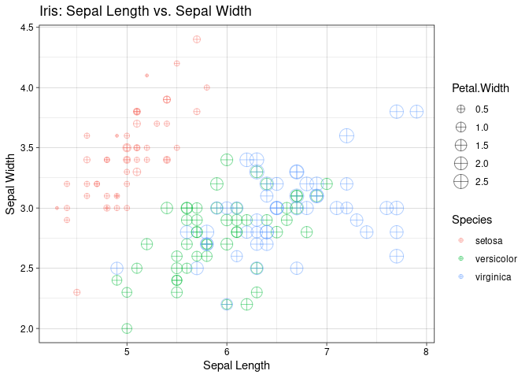
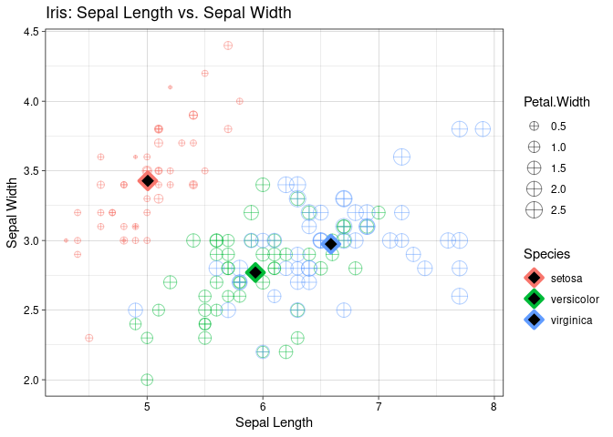

Postwork
================
Nieves
2022-11-17

# Postwork Sesión 2.

#### Objetivo

“- Conocer algunas de las bases de datos disponibles en `R` - Observar
algunas características y manipular los DataFrames con `dplyr` -
Realizar visualizaciones con `ggplot`

``` r
install.packages("tidyverse")
```

    ## Installing package into '/cloud/lib/x86_64-pc-linux-gnu-library/4.2'
    ## (as 'lib' is unspecified)

``` r
library(tidyverse)
```

    ## ── Attaching packages
    ## ───────────────────────────────────────
    ## tidyverse 1.3.2 ──

    ## ✔ ggplot2 3.4.0      ✔ purrr   0.3.5 
    ## ✔ tibble  3.1.8      ✔ dplyr   1.0.10
    ## ✔ tidyr   1.2.1      ✔ stringr 1.4.1 
    ## ✔ readr   2.1.3      ✔ forcats 0.5.2 
    ## ── Conflicts ────────────────────────────────────────── tidyverse_conflicts() ──
    ## ✖ dplyr::filter() masks stats::filter()
    ## ✖ dplyr::lag()    masks stats::lag()

#### Requisitos

1.  Tener instalado R y RStudio
2.  Haber realizado el prework y estudiado los ejemplos de la sesión.”

#### Desarrollo

“1) Inspecciona el DataSet iris disponible directamente en la librería
de ggplot. Identifica las variables que contiene y su tipo, asegúrate de
que no hayan datos faltantes y que los datos se encuentran listos para
usarse.”

``` r
data("iris")
str(iris)
```

    ## 'data.frame':    150 obs. of  5 variables:
    ##  $ Sepal.Length: num  5.1 4.9 4.7 4.6 5 5.4 4.6 5 4.4 4.9 ...
    ##  $ Sepal.Width : num  3.5 3 3.2 3.1 3.6 3.9 3.4 3.4 2.9 3.1 ...
    ##  $ Petal.Length: num  1.4 1.4 1.3 1.5 1.4 1.7 1.4 1.5 1.4 1.5 ...
    ##  $ Petal.Width : num  0.2 0.2 0.2 0.2 0.2 0.4 0.3 0.2 0.2 0.1 ...
    ##  $ Species     : Factor w/ 3 levels "setosa","versicolor",..: 1 1 1 1 1 1 1 1 1 1 ...

``` r
complete.cases(iris)
```

    ##   [1] TRUE TRUE TRUE TRUE TRUE TRUE TRUE TRUE TRUE TRUE TRUE TRUE TRUE TRUE TRUE
    ##  [16] TRUE TRUE TRUE TRUE TRUE TRUE TRUE TRUE TRUE TRUE TRUE TRUE TRUE TRUE TRUE
    ##  [31] TRUE TRUE TRUE TRUE TRUE TRUE TRUE TRUE TRUE TRUE TRUE TRUE TRUE TRUE TRUE
    ##  [46] TRUE TRUE TRUE TRUE TRUE TRUE TRUE TRUE TRUE TRUE TRUE TRUE TRUE TRUE TRUE
    ##  [61] TRUE TRUE TRUE TRUE TRUE TRUE TRUE TRUE TRUE TRUE TRUE TRUE TRUE TRUE TRUE
    ##  [76] TRUE TRUE TRUE TRUE TRUE TRUE TRUE TRUE TRUE TRUE TRUE TRUE TRUE TRUE TRUE
    ##  [91] TRUE TRUE TRUE TRUE TRUE TRUE TRUE TRUE TRUE TRUE TRUE TRUE TRUE TRUE TRUE
    ## [106] TRUE TRUE TRUE TRUE TRUE TRUE TRUE TRUE TRUE TRUE TRUE TRUE TRUE TRUE TRUE
    ## [121] TRUE TRUE TRUE TRUE TRUE TRUE TRUE TRUE TRUE TRUE TRUE TRUE TRUE TRUE TRUE
    ## [136] TRUE TRUE TRUE TRUE TRUE TRUE TRUE TRUE TRUE TRUE TRUE TRUE TRUE TRUE TRUE

``` r
sum(complete.cases(iris))
```

    ## [1] 150

“2) Crea una gráfica de puntos que contenga `Sepal.Lenght` en el eje
horizontal, `Sepal.Width` en el eje vertical, que identifique `Species`
por color y que el tamaño de la figura está representado por
`Petal.Width`. Asegúrate de que la geometría contenga `shape = 10` y
`alpha = 0.5`.”

``` r
ggplot(iris, aes(x = Sepal.Length, y=Sepal.Width, color = Species, size = Petal.Width)) + 
  geom_point(shape=10, alpha=0.5) +
  labs(title = "Iris: Sepal Length vs. Sepal Width", x= "Sepal Length", y="Sepal Width") +
  theme_linedraw()
```

<!-- -->

“3) Crea una tabla llamada `iris_mean` que contenga el promedio de todas
las variables agrupadas por `Species`.”

``` r
iris_mean <- iris %>% 
  group_by(Species) %>% 
  summarise(mean_Sepal.Length= mean(Sepal.Length),
            mean_Sepal.Width= mean(Sepal.Width),
            mean_Petal.Length= mean(Petal.Length),
            mean_Petal.Width= mean(Petal.Width))
```

``` r
iris_mean
```

    ## # A tibble: 3 × 5
    ##   Species    mean_Sepal.Length mean_Sepal.Width mean_Petal.Length mean_Petal.W…¹
    ##   <fct>                  <dbl>            <dbl>             <dbl>          <dbl>
    ## 1 setosa                  5.01             3.43              1.46          0.246
    ## 2 versicolor              5.94             2.77              4.26          1.33 
    ## 3 virginica               6.59             2.97              5.55          2.03 
    ## # … with abbreviated variable name ¹​mean_Petal.Width

“4) Con esta tabla, agrega a tu gráfica anterior otra geometría de
puntos para agregar los promedios en la visualización. Asegúrate que el
primer argumento de la geometría sea el nombre de tu tabla y que los
parámetros sean `shape = 23`, `size = 4`, `fill = 'black'` y
`stroke = 2`. También agrega etiquetas, temas y los cambios necesarios
para mejorar tu visualización.”

``` r
ggplot(iris, aes(x = Sepal.Length, y=Sepal.Width, color = Species, size = Petal.Width)) + 
  geom_point(shape=10, alpha=0.5) +
  geom_point(iris_mean, mapping=aes(x=mean_Sepal.Length, y=mean_Sepal.Width), stroke = 2, fill = 'black', shape=23, size=4)+
  labs(title = "Iris: Sepal Length vs. Sepal Width", x="Sepal Length", y= "Sepal Width") +
  theme_linedraw()
```

<!-- -->
