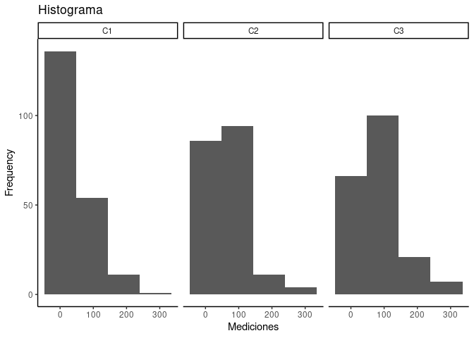
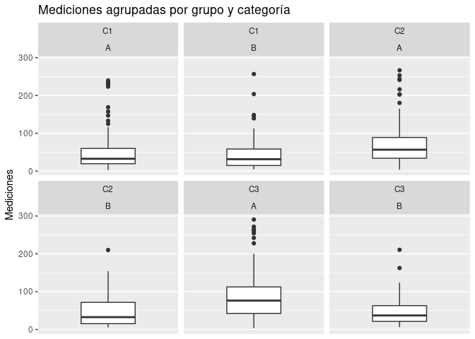

Postwork3
================
Nieves
2022-11-18

# Postwork Sesión 3

#### Objetivo

\#- Realizar un análisis descriptivo de las variables de un dataframe

#### Requisitos

\#1. R, RStudio \#2. Haber realizado el prework y seguir el curso de los
ejemplos de la sesión \#3. Curiosidad por investigar nuevos tópicos y
funciones de R

#### Desarrollo

``` r
library(tidyverse)
```

    ## ── Attaching packages ─────────────────────────────────────── tidyverse 1.3.2 ──
    ## ✔ ggplot2 3.4.0      ✔ purrr   0.3.5 
    ## ✔ tibble  3.1.8      ✔ dplyr   1.0.10
    ## ✔ tidyr   1.2.1      ✔ stringr 1.4.1 
    ## ✔ readr   2.1.3      ✔ forcats 0.5.2 
    ## ── Conflicts ────────────────────────────────────────── tidyverse_conflicts() ──
    ## ✖ dplyr::filter() masks stats::filter()
    ## ✖ dplyr::lag()    masks stats::lag()

``` r
install.packages("DescTools")
```

    ## Installing package into '/cloud/lib/x86_64-pc-linux-gnu-library/4.2'
    ## (as 'lib' is unspecified)

``` r
library(DescTools)
install.packages("moments")
```

    ## Installing package into '/cloud/lib/x86_64-pc-linux-gnu-library/4.2'
    ## (as 'lib' is unspecified)

``` r
library(moments)
```

“Utilizando el dataframe `boxp.csv` realiza el siguiente análisis
descriptivo. No olvides excluir los missing values y transformar las
variables a su tipo y escala correspondiente.”

``` r
df <- read.csv("https://raw.githubusercontent.com/beduExpert/Programacion-R-Santander-2022/main/Sesion-03/Data/boxp.csv")
str(df)
```

    ## 'data.frame':    615 obs. of  3 variables:
    ##  $ Categoria : chr  "C1" "C1" "C1" "C1" ...
    ##  $ Grupo     : int  0 1 0 0 0 0 0 0 1 1 ...
    ##  $ Mediciones: num  82.6 112.6 42.8 44.6 21.6 ...

``` r
summary(df)
```

    ##   Categoria             Grupo          Mediciones    
    ##  Length:615         Min.   :0.0000   Min.   :  2.80  
    ##  Class :character   1st Qu.:0.0000   1st Qu.: 23.45  
    ##  Mode  :character   Median :0.0000   Median : 49.30  
    ##                     Mean   :0.2439   Mean   : 62.88  
    ##                     3rd Qu.:0.0000   3rd Qu.: 82.85  
    ##                     Max.   :1.0000   Max.   :290.60  
    ##                                      NA's   :24

``` r
df$Categoria <- factor(df$Categoria)
df$Grupo <- factor(df$Grupo, labels = c("A","B") )
```

``` r
sum(complete.cases(df))
```

    ## [1] 591

``` r
df.clean <- df[complete.cases(df),]
summary(df.clean)
```

    ##  Categoria Grupo     Mediciones    
    ##  C1:202    A:444   Min.   :  2.80  
    ##  C2:195    B:147   1st Qu.: 23.45  
    ##  C3:194            Median : 49.30  
    ##                    Mean   : 62.88  
    ##                    3rd Qu.: 82.85  
    ##                    Max.   :290.60

\#1) Calcula e interpreta las medidas de tendencia central de la
variable `Mediciones`

``` r
mean(df.clean$Mediciones)  
```

    ## [1] 62.88494

``` r
median(df.clean$Mediciones) 
```

    ## [1] 49.3

``` r
Mode(df.clean$Mediciones)[1] 
```

    ## [1] 23.3

\#2) Con base en tu resultado anterior, ¿qué se puede concluir respecto
al sesgo de `Mediciones`? \## Dado que se cumple la condición moda \<
mediana \< media, esta sesgado a la derecha.
skewness(df.clean\$Mediciones) \#1.729 puesto que es \> a 1, esto
representa sesgo a la derecha \#3) Calcula e interpreta la desviación
estándar y los cuartiles de la distribución de `Mediciones`

``` r
var(df.clean$Mediciones) 
```

    ## [1] 2891.183

``` r
sd(df.clean$Mediciones) 
```

    ## [1] 53.76972

``` r
cuartiles <- quantile(df.clean$Mediciones, probs= c(0.25, 0.5, 0.75))
cuartiles   
```

    ##   25%   50%   75% 
    ## 23.45 49.30 82.85

“El 50% de los datos se concentran entre 23.45 y 82.85”

“4) Con ggplot, realiza un histograma separando la distribución de
`Mediciones` por `Categoría` ¿Consideras que sólo una categoría está
generando el sesgo? No, todos las categorias contribuyen, todas se
encuentran con un sesgo a la derecha, aunque sí en mayor medida la clase
C1.”

``` r
  ggplot(df.clean, aes(Mediciones)) +
  geom_histogram(bins = 4) + 
  labs(title = "Histograma", 
       x = "Mediciones",
       y = "Frequency") + 
  theme_classic() +
  facet_wrap(~df.clean$Categoria)
```

<!-- -->

“5) Con ggplot, realiza un boxplot separando la distribución de
`Mediciones` por `Categoría` y por `Grupo` dentro de cada categoría.
¿Consideras que hay diferencias entre categorías? ¿Los grupos al
interior de cada categoría podrían estar generando el sesgo?” “Las
categorias C2 y C3 en el grupo A si muestran una mayor dispersion que su
grupo B”

``` r
ggplot(df.clean, aes(y= Mediciones)) + 
  geom_boxplot() + 
  scale_x_discrete( ) +
  labs(title = "Mediciones agrupadas por grupo y categoría",
       y = "Mediciones") +
  facet_wrap(df.clean$Categoria~df.clean$Grupo)
```

<!-- -->
