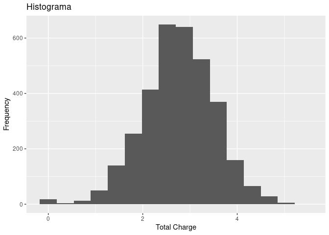
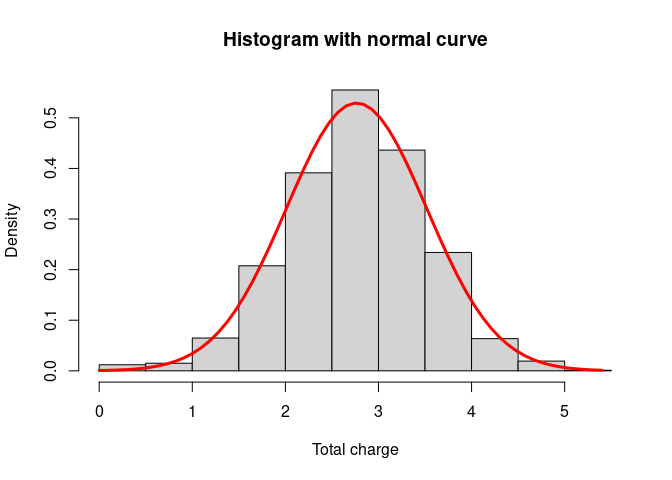
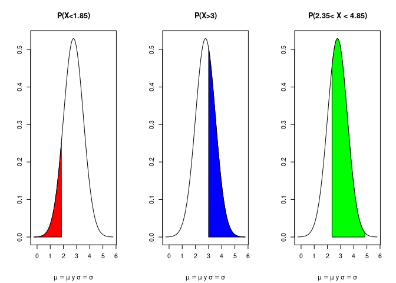

Prueba
================
Nieves
2022-11-17

# POSTWORK_4

``` r
library(DescTools)
library(tidyverse)
```

    ## ── Attaching packages ─────────────────────────────────────── tidyverse 1.3.2 ──
    ## ✔ ggplot2 3.3.6      ✔ purrr   0.3.5 
    ## ✔ tibble  3.1.8      ✔ dplyr   1.0.10
    ## ✔ tidyr   1.2.1      ✔ stringr 1.4.1 
    ## ✔ readr   2.1.3      ✔ forcats 0.5.2 
    ## ── Conflicts ────────────────────────────────────────── tidyverse_conflicts() ──
    ## ✖ dplyr::filter() masks stats::filter()
    ## ✖ dplyr::lag()    masks stats::lag()

``` r
library(DescTools)
```

``` r
df <- read.csv("https://raw.githubusercontent.com/beduExpert/Programacion-R-Santander-2022/main/Sesion-03/Data/telecom_service.csv")
summary(df)
```

    ##  international_plan voice_mail_plan  number_vmail_messages total_day_minutes
    ##  Min.   :0.00000    Min.   :0.0000   Min.   : 0.000        Min.   :  0.0    
    ##  1st Qu.:0.00000    1st Qu.:0.0000   1st Qu.: 0.000        1st Qu.:143.7    
    ##  Median :0.00000    Median :0.0000   Median : 0.000        Median :179.4    
    ##  Mean   :0.09691    Mean   :0.2766   Mean   : 8.099        Mean   :179.8    
    ##  3rd Qu.:0.00000    3rd Qu.:1.0000   3rd Qu.:20.000        3rd Qu.:216.4    
    ##  Max.   :1.00000    Max.   :1.0000   Max.   :51.000        Max.   :350.8    
    ##  total_day_calls total_day_charge total_eve_minutes total_eve_calls
    ##  Min.   :  0.0   Min.   : 0.00    Min.   :  0.0     Min.   :  0.0  
    ##  1st Qu.: 87.0   1st Qu.:24.43    1st Qu.:166.6     1st Qu.: 87.0  
    ##  Median :101.0   Median :30.50    Median :201.4     Median :100.0  
    ##  Mean   :100.4   Mean   :30.56    Mean   :201.0     Mean   :100.1  
    ##  3rd Qu.:114.0   3rd Qu.:36.79    3rd Qu.:235.3     3rd Qu.:114.0  
    ##  Max.   :165.0   Max.   :59.64    Max.   :363.7     Max.   :170.0  
    ##  total_eve_charge total_night_minutes total_night_calls total_night_charge
    ##  Min.   : 0.00    Min.   : 23.2       Min.   : 33.0     Min.   : 1.040    
    ##  1st Qu.:14.16    1st Qu.:167.0       1st Qu.: 87.0     1st Qu.: 7.520    
    ##  Median :17.12    Median :201.2       Median :100.0     Median : 9.050    
    ##  Mean   :17.08    Mean   :200.9       Mean   :100.1     Mean   : 9.039    
    ##  3rd Qu.:20.00    3rd Qu.:235.3       3rd Qu.:113.0     3rd Qu.:10.590    
    ##  Max.   :30.91    Max.   :395.0       Max.   :175.0     Max.   :17.770    
    ##  total_intl_minutes total_intl_calls total_intl_charge customer_service_calls
    ##  Min.   : 0.00      Min.   : 0.000   Min.   :0.000     Min.   :0.000         
    ##  1st Qu.: 8.50      1st Qu.: 3.000   1st Qu.:2.300     1st Qu.:1.000         
    ##  Median :10.30      Median : 4.000   Median :2.780     Median :1.000         
    ##  Mean   :10.24      Mean   : 4.479   Mean   :2.765     Mean   :1.563         
    ##  3rd Qu.:12.10      3rd Qu.: 6.000   3rd Qu.:3.270     3rd Qu.:2.000         
    ##  Max.   :20.00      Max.   :20.000   Max.   :5.400     Max.   :9.000         
    ##      churn       
    ##  Min.   :0.0000  
    ##  1st Qu.:0.0000  
    ##  Median :0.0000  
    ##  Mean   :0.1449  
    ##  3rd Qu.:0.0000  
    ##  Max.   :1.0000

### Medidas de tendencia central

``` r
mean(df$total_intl_charge)
```

    ## [1] 2.764581

``` r
median(df$total_intl_charge)
```

    ## [1] 2.78

``` r
Mode(df$total_intl_charge)
```

    ## [1] 2.7
    ## attr(,"freq")
    ## [1] 62

### Medidas de dispersión

``` r
var(df$total_intl_charge)
```

    ## [1] 0.5681732

``` r
sd(df$total_intl_charge)
```

    ## [1] 0.7537726

Dado que la media, la mediana y la moda son aproximadamente iguales
podriamos hablar de una tendencia normal.

Para corroborar vamos a graficar el histograma

``` r
ggplot() +
  geom_histogram(aes(df$total_intl_charge),bins = 16 ) + 
  labs(title = "Histograma", 
       x = "Total Charge",
       y = "Frequency") 
```

<!-- -->

### Graficamos la densidad de probabilidad y el histograma para comparar

1.- Grafica la distribución teórica de la variable aleatoria
total_intl_charge

``` r
hist(df$total_intl_charge, prob = TRUE, main = "Histogram with normal curve", , xlab = "Total charge")
x <- seq(min(df$total_intl_charge), max(df$total_intl_charge), length = 60)
f <- dnorm(x, mean = mean(df$total_intl_charge), sd = sd(df$total_intl_charge))
lines(x, f, col = "red", lwd = 3)
```

<!-- -->

``` r
mu <- mean(df$total_intl_charge)
sigma <- sd(df$total_intl_charge)
x <- x <- seq(-4, 4, 0.01)*sigma + mu 
y <- dnorm(x, mean = mu, sd = sigma) 
```

“2. ¿Cuál es la probabilidad de que e ltotal de cargos internacionales
sea menor a 1.85 usd?”

``` r
pnorm(q = 1.85, mean = mu, sd = sigma)
```

    ## [1] 0.1125002

“3. ¿Cuál es la probabilidad de que el total de cargos internacionales
sea mayor a 3 usd?”

``` r
pnorm(q = 3, mean = mu, sd = sigma, lower.tail = FALSE )
```

    ## [1] 0.3773985

“4. ¿Cuál es la probabilidad de que el total de cargos internacionales
esté entre 2.35 usd y 4.85 usd?”

``` r
pnorm(q = 4.85, mean = mean(df$total_intl_charge), sd = sd(df$total_intl_charge))-
  pnorm(q = 2.35, mean = mean(df$total_intl_charge), sd = sd(df$total_intl_charge))
```

    ## [1] 0.7060114

### La probabilidad para las preguntas 3, 4 y 5 visualmente se ve de la siguiente manera

``` r
par(mfrow = c(1, 3))
plot(x, y, type = "l", xlab = "", ylab = "")
title(main = "P(X<1.85)", sub = expression(paste(mu == mu, " y ", sigma == sigma)))

polygon(c(min(x), x[x<=1.85], 1.85), c(0, y[x<=1.85], 0), col="red")

plot(x, y, type = "l", xlab = "", ylab = "")
title(main = "P(X>3)", sub = expression(paste(mu == mu, " y ", sigma == sigma)))

polygon(c(3, x[x>=3], max(x)), c(0, y[x>=3], 0), col="blue")

plot(x, y, type = "l", xlab="", ylab="")
title(main = "P(2.35< X < 4.85)", sub = expression(paste(mu == mu, " y ", sigma == sigma)))

polygon(c(2.35, x[x>=2.35 & x<=4.85], 4.85), c(0, y[x>=2.35 & x<=4.85], 0), col="green")
```

<!-- -->

5.  Con una probabilidad de 0.48,¿cuál es el total de cargos
    internacionales más alto que podría esperar?

``` r
qnorm(p=0.48, mean=mean(df$total_intl_charge), sd=mean(df$total_intl_charge))
```

    ## [1] 2.625928

“6. ¿Cuáles son los valores del total de cargos internacionales que
dejan exactamente al centro el 80% de probabilidad?”

``` r
qnorm(p=0.10, mean=mu, sd=sigma)
```

    ## [1] 1.798583

``` r
qnorm(p=0.10, mean=mu, sd=sigma, lower.tail = FALSE)
```

    ## [1] 3.73058
