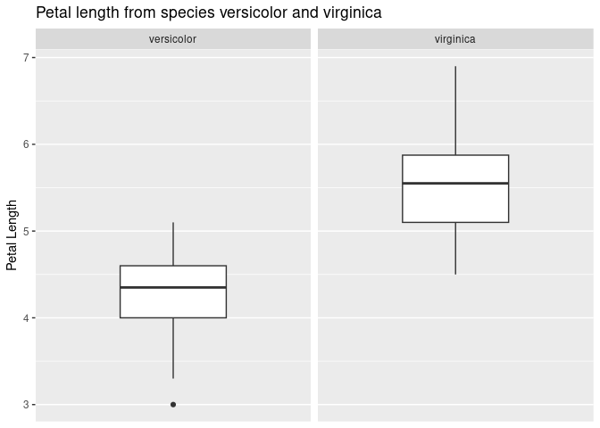
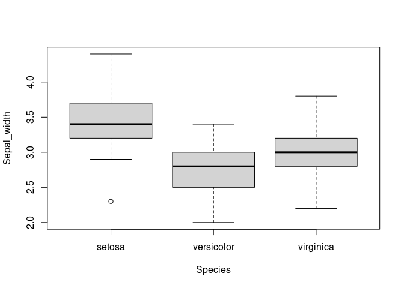

Postwork_5
================
Nieves
2022-12-07

## Postwork_5

El data frame iris contiene información recolectada por Anderson sobre
50 flores de 3 especies distintas (setosa, versicolor y virginca),
incluyendo medidas en centímetros del largo y ancho del sépalo así como
de los pétalos.

Estudios recientes sobre las mismas especies muestran que:

Utilizando pruebas de inferencia estadística, concluye si existe
evidencia suficiente para concluir que los datos recolectados por
Anderson están en línea con los nuevos estudios.

Utiliza 99% de confianza para todas las pruebas, en cada caso realiza el
planteamiento de hipótesis adecuado y concluye

``` r
library(tidyverse)
```

    ## ── Attaching packages ─────────────────────────────────────── tidyverse 1.3.2 ──
    ## ✔ ggplot2 3.4.0      ✔ purrr   0.3.5 
    ## ✔ tibble  3.1.8      ✔ dplyr   1.0.10
    ## ✔ tidyr   1.2.1      ✔ stringr 1.4.1 
    ## ✔ readr   2.1.3      ✔ forcats 0.5.2 
    ## ── Conflicts ────────────────────────────────────────── tidyverse_conflicts() ──
    ## ✖ dplyr::filter() masks stats::filter()
    ## ✖ dplyr::lag()    masks stats::lag()

``` r
data("iris")
```

\*\* I. En promedio, el largo del sépalo de la especie setosa
(Sepal.Length) es igual a 5.7 cm\*\*

Nivel de confianza 99%, nivel de significancia 0.01

1.  Ho $\mu = 5.7$cm
2.  Ha $\mu != 5.7$ cm

``` r
t.test(x=iris$Sepal.Length, alternative = "two.sided", mu=5.7)
```

    ## 
    ##  One Sample t-test
    ## 
    ## data:  iris$Sepal.Length
    ## t = 2.12, df = 149, p-value = 0.03567
    ## alternative hypothesis: true mean is not equal to 5.7
    ## 95 percent confidence interval:
    ##  5.709732 5.976934
    ## sample estimates:
    ## mean of x 
    ##  5.843333

R.- \* Dado que el p-value = 0.03567 y este valor es mayor a 0.01
entonces EEE de aceptar la hipotesis nula esto quiere decir que en
promedio el largo del sepalo de la especie setosa es igual a 5.7 cm.\*

\*\* II. En promedio, el ancho del pétalo de la especie virginica
(Petal.Width) es menor a 2.1 cm\*\*

1.  Ho $\mu >= 2.1$ cm
2.  Ha $\mu < 2.1$ cm

``` r
t.test(x=iris$Petal.Width, alternative = "less", mu=2.1)
```

    ## 
    ##  One Sample t-test
    ## 
    ## data:  iris$Petal.Width
    ## t = -14.472, df = 149, p-value < 2.2e-16
    ## alternative hypothesis: true mean is less than 2.1
    ## 95 percent confidence interval:
    ##      -Inf 1.302344
    ## sample estimates:
    ## mean of x 
    ##  1.199333

R.- \* En este caso el p-value es de 2.2e-16, un valor aproximadamente
cero y por tanto menor a 0.01, entonces EEE para rechazar la hipotesis
nula, esto es el ancho del petalo de la especie virginica es menor a 2.1
cm.\*

\*\* III. En promedio, el largo del pétalo de la especie virgínica es
1.1 cm más grande que el promedio del largo del pétalo de la especie
versicolor.\*\*

La prueba de varianzas es la siguiente:

1.  Ho: razon =1 $\mu_{pl.virginica} = \mu_{pl.versicolor}$
2.  Ha: razon !=1: $\mu_{pl.virginica} > \mu_{pl.versicolor}$

``` r
var.test(iris[iris$Species == "virginica" , "Petal.Length"],
         iris[iris$Species == "versicolor" , "Petal.Length"],
         ratio = 1, alternative = "two.sided")
```

    ## 
    ##  F test to compare two variances
    ## 
    ## data:  iris[iris$Species == "virginica", "Petal.Length"] and iris[iris$Species == "versicolor", "Petal.Length"]
    ## F = 1.3794, num df = 49, denom df = 49, p-value = 0.2637
    ## alternative hypothesis: true ratio of variances is not equal to 1
    ## 95 percent confidence interval:
    ##  0.7827605 2.4307127
    ## sample estimates:
    ## ratio of variances 
    ##           1.379372

R.-\* El p-value en la prueba de varianza es de 0.2637, la taza de
varianza es de 1.3793.\*

``` r
t.test(x=iris[iris$Species == "virginica" , "Petal.Length"],
         y= iris[iris$Species == "versicolor" , "Petal.Length"],
        alternative = "greater", mu =0, var.equal= FALSE)
```

    ## 
    ##  Welch Two Sample t-test
    ## 
    ## data:  iris[iris$Species == "virginica", "Petal.Length"] and iris[iris$Species == "versicolor", "Petal.Length"]
    ## t = 12.604, df = 95.57, p-value < 2.2e-16
    ## alternative hypothesis: true difference in means is greater than 0
    ## 95 percent confidence interval:
    ##  1.121737      Inf
    ## sample estimates:
    ## mean of x mean of y 
    ##     5.552     4.260

R.-\* Dado que el valor p-values es aproximadamente cero, se puede
rechazar la hipotesis nula, esto es el promedio entre la longitud del
petalo no es el mismo para las especies virginica y versicolor, es 1.1
cm más grande.\*

``` r
df <- iris %>% 
  select(Species, Petal.Length) %>%   
  filter(Species == "virginica" | Species =="versicolor" ) %>% 
  ggplot() + 
  geom_boxplot(mapping=aes(y=Petal.Length )) + 
  scale_x_discrete( ) +
  labs(title = "Petal length from species versicolor and virginica",
       y = "Petal Length") +
  facet_wrap(~Species)
```

``` r
df
```

<!-- -->

\*\* IV. En promedio, no existe diferencia en el ancho del sépalo entre
las 3 especies.\*\*

1.  Ho $\mu_{sepal} = \mu_{virginica} = \mu_{versicolor}$
2.  Ha $\mu_{sepal} != \mu_{virginica} != \mu_{versicolor}$

``` r
Species <- iris$Species
Sepal_width <- iris$Sepal.Width
```

``` r
boxplot(Sepal_width ~ Species)
```

<!-- -->

``` r
anova_test <- aov(Sepal_width ~ Species)
```

``` r
summary(anova_test)
```

    ##              Df Sum Sq Mean Sq F value Pr(>F)    
    ## Species       2  11.35   5.672   49.16 <2e-16 ***
    ## Residuals   147  16.96   0.115                   
    ## ---
    ## Signif. codes:  0 '***' 0.001 '**' 0.01 '*' 0.05 '.' 0.1 ' ' 1

R.\* Dado que el valor p-value = Pr es muy cercano a cero entonces se
rechaza la hipotesis nula, esto quiere decir que, el promedio del ancho
del petalo entre las tres especies es distinto, o por lo menos dos de
estas especies.\*
