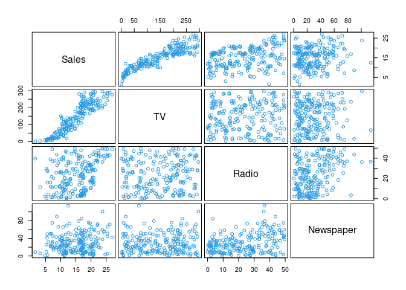
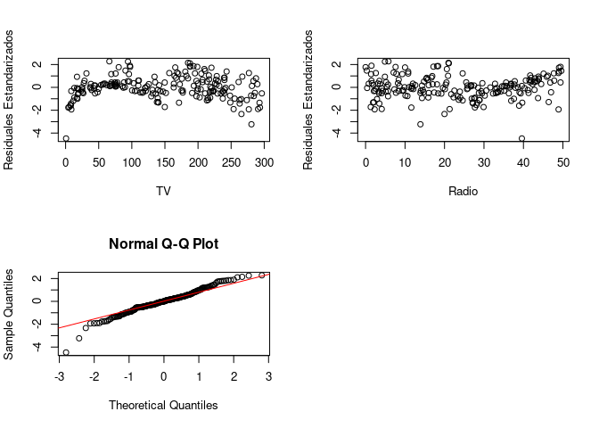

Postwork_6
================
Nieves
2022-12-07

#### Planteamiento del problema

Supongamos que nuestro trabajo consiste en aconsejar a un cliente sobre
como mejorar las ventas de un producto particular, y el conjunto de
datos con el que disponemos son datos de publicidad que consisten en las
ventas de aquel producto en 200 diferentes mercados, junto con
presupuestos de publicidad para el producto en cada uno de aquellos
mercados para tres medios de comunicación diferentes: TV, radio, y
periódico. No es posible para nuestro cliente incrementar directamente
las ventas del producto. Por otro lado, ellos pueden controlar el gasto
en publicidad para cada uno de los tres medios de comunicación. Por lo
tanto, si determinamos que hay una asociación entre publicidad y ventas,
entonces podemos instruir a nuestro cliente para que ajuste los
presupuestos de publicidad, y así indirectamente incrementar las ventas.

#### Desarrollo

Primero leemos los datos

``` r
adv <- read.csv("https://raw.githubusercontent.com/beduExpert/Programacion-R-Santander-2022/main/Sesion-06/data/advertising.csv")
```

Vemos el contenido de la tabla con ayuda de la función `head`

``` r
head(adv)
```

    ##      TV Radio Newspaper Sales
    ## 1 230.1  37.8      69.2  22.1
    ## 2  44.5  39.3      45.1  10.4
    ## 3  17.2  45.9      69.3  12.0
    ## 4 151.5  41.3      58.5  16.5
    ## 5 180.8  10.8      58.4  17.9
    ## 6   8.7  48.9      75.0   7.2

Reordenamos los datos para tener la variable dependiente en la primer
columna teniendo las siguientes consideraciones

- Y: Sales (Ventas de un producto)
- X1: TV (Presupuesto de publicidad en TV para el producto)
- X2: Radio (Presupuesto de publicidad en Radio para el producto)
- X3: Newspaper (Presupuesto de publicidad en Periódico para el
  producto) ”

``` r
col_order <- c("Sales", "TV", "Radio","Newspaper")
```

``` r
adv2 <- adv[, col_order]
```

Vemos como queda reordenada la tabla haciendo uso nuevamente de la
función `head`

``` r
head(adv2)
```

    ##   Sales    TV Radio Newspaper
    ## 1  22.1 230.1  37.8      69.2
    ## 2  10.4  44.5  39.3      45.1
    ## 3  12.0  17.2  45.9      69.3
    ## 4  16.5 151.5  41.3      58.5
    ## 5  17.9 180.8  10.8      58.4
    ## 6   7.2   8.7  48.9      75.0

#### Obtenemos la matriz de correlación

Por default la función `cor` emplea el método de Pearson, para el cual
el rango de valores va de -1 a 1, con -1 y 1 indicando perfecta
correlación negativa y positiva respectivamente. Que tan fuerte es la correlación 
dependiendo del valor que se obtenga lo podemos ver en la siguiente tabla:

| correlación | no    | Pequeña | Mediana     | Grande  |
|  :--- :  | :--- :       |    :----:   |   :---: |.  :---: |
| negativa | -0.09 a 0.0      | -0.3 a -0.1  | -0.5 a -0.3  | -1.0 a -0.5  |
| positiva | 0.0 a 0.09   | 0.1 a 0.3        | 0.3 a 0.5   | 0.5 a 1.0     |

``` r
round(cor(adv2),4)
```

    ##            Sales     TV  Radio Newspaper
    ## Sales     1.0000 0.9012 0.3496    0.1580
    ## TV        0.9012 1.0000 0.0548    0.0566
    ## Radio     0.3496 0.0548 1.0000    0.3541
    ## Newspaper 0.1580 0.0566 0.3541    1.0000

De acuerdo a la tabla anterior las correlaciones entre Sales y TV es
grande, mientras que para Sales y Radio es mediana de 0.3496 y para
Sales y Newspaper es pequeña.

``` r
attach(adv2)
```

#### Visualizamos la relación entre pares de variables, de tal manera que podemos observar las correlaciones antes obtenidas con ayuda de la función `pairs`

``` r
pairs(~ Sales + TV + Radio +  Newspaper, 
      data = adv2, gap = 0.4, cex.labels = 1.5, col = 4)
```

<!-- -->

#### Vamos a utilizar el modelo de regresión lineal para hacer recomendaciones al cliente, sobre cómo podría incrementar las ventas. El primer modelo incluye las tres variables independientes: TV, Radio y Newspaper.

``` r
m1 <- lm(Sales ~ TV + Radio +  Newspaper)
```

Vemos el resultado del modelo con ayuda de la función `summary`

``` r
summary(m1)
```

    ## 
    ## Call:
    ## lm(formula = Sales ~ TV + Radio + Newspaper)
    ## 
    ## Residuals:
    ##     Min      1Q  Median      3Q     Max 
    ## -7.3034 -0.8244 -0.0008  0.8976  3.7473 
    ## 
    ## Coefficients:
    ##              Estimate Std. Error t value Pr(>|t|)    
    ## (Intercept) 4.6251241  0.3075012  15.041   <2e-16 ***
    ## TV          0.0544458  0.0013752  39.592   <2e-16 ***
    ## Radio       0.1070012  0.0084896  12.604   <2e-16 ***
    ## Newspaper   0.0003357  0.0057881   0.058    0.954    
    ## ---
    ## Signif. codes:  0 '***' 0.001 '**' 0.01 '*' 0.05 '.' 0.1 ' ' 1
    ## 
    ## Residual standard error: 1.662 on 196 degrees of freedom
    ## Multiple R-squared:  0.9026, Adjusted R-squared:  0.9011 
    ## F-statistic: 605.4 on 3 and 196 DF,  p-value: < 2.2e-16

Las hipotesis para el modelo son:

1.  Ho $\beta_i =0$
2.  Ha: $\beta_i != 0$

R. Del resumen los p- values nos muestran que se rechaza la hipótesis
nula, Ho a favor de la hipótesis alternativa tanto para TV y Radio. La R
ajustada al cuadrado es 0.9011, en cuanto a la variable newspaper
podemos aceptar la hipótesis nula y no nos proporciona mucha
información, por lo que podemos probar el ajuste sin esta. Tambien
observamos que por cada unidad que se incrementa en TV las ventas suben
0.0544, mientras que por casa unidad que se incrementa la publicidad en
radio las ventas suben 0.1070, en el caso del periódico el incremento es
muy bajo.

#### Para el segundo modelo quitamos la variable Newspaper

``` r
m2 <- update(m1,~ .-Newspaper)
```

Vemos que resultados nos arroja

``` r
summary(m2)
```

    ## 
    ## Call:
    ## lm(formula = Sales ~ TV + Radio)
    ## 
    ## Residuals:
    ##     Min      1Q  Median      3Q     Max 
    ## -7.3131 -0.8269  0.0095  0.9022  3.7484 
    ## 
    ## Coefficients:
    ##             Estimate Std. Error t value Pr(>|t|)    
    ## (Intercept) 4.630879   0.290308   15.95   <2e-16 ***
    ## TV          0.054449   0.001371   39.73   <2e-16 ***
    ## Radio       0.107175   0.007926   13.52   <2e-16 ***
    ## ---
    ## Signif. codes:  0 '***' 0.001 '**' 0.01 '*' 0.05 '.' 0.1 ' ' 1
    ## 
    ## Residual standard error: 1.657 on 197 degrees of freedom
    ## Multiple R-squared:  0.9026, Adjusted R-squared:  0.9016 
    ## F-statistic: 912.7 on 2 and 197 DF,  p-value: < 2.2e-16

R. Para este modelo también se rechaza la hipótesis nula a favor de la
hipótesis alternativa y el r cuadrado ajustado nos da de 0.9016,
incremento en el ultimo dígito por lo que podríamos considerar que es
mejor que el anterior, pero por muy poco.

#### Para el ultimo modelo quitamos radio al segundo modelo, quedando únicamete TV

``` r
m3 <- update(m2,~ .-Radio)
```

``` r
summary(m3)
```

    ## 
    ## Call:
    ## lm(formula = Sales ~ TV)
    ## 
    ## Residuals:
    ##     Min      1Q  Median      3Q     Max 
    ## -6.4438 -1.4857  0.0218  1.5042  5.6932 
    ## 
    ## Coefficients:
    ##             Estimate Std. Error t value Pr(>|t|)    
    ## (Intercept) 6.974821   0.322553   21.62   <2e-16 ***
    ## TV          0.055465   0.001896   29.26   <2e-16 ***
    ## ---
    ## Signif. codes:  0 '***' 0.001 '**' 0.01 '*' 0.05 '.' 0.1 ' ' 1
    ## 
    ## Residual standard error: 2.296 on 198 degrees of freedom
    ## Multiple R-squared:  0.8122, Adjusted R-squared:  0.8112 
    ## F-statistic: 856.2 on 1 and 198 DF,  p-value: < 2.2e-16

R. En este caso el r ajustado disminuye considerablemente, por lo que
podemos descartar definitivamente este modelo”

Mi recomendación al cliente, seria que invierta mas presupuesto en
publicidad para TV y en radio en menor medida, dejando de fuera el
periodico.

Ahora vamos a revisar los residuos estandarizados y ver si se comportan
como una función normal para el modelo que mejor nos dio el ajuste, en
base a la $R^ 2$ ajustada

``` r
StanRes2 <- rstandard(m2) 
```

``` r
par(mfrow = c(2, 2))

plot(TV, StanRes2, ylab = "Residuales Estandarizados")
plot(Radio, StanRes2, ylab = "Residuales Estandarizados")
qqnorm(StanRes2)
qqline(StanRes2, col = "red")
```

<!-- -->

R. como podemos ver la linea teórica coincide con los gráficos, lo que
podemos decir en un principio que la distribución se ve como una normal,
para corroborar, hacemos la prueba `shapiro.test`

``` r
shapiro.test(StanRes2)
```

    ## 
    ##  Shapiro-Wilk normality test
    ## 
    ## data:  StanRes2
    ## W = 0.97535, p-value = 0.001365

1.  Ho: La variable distribuye como una normal
2.  Ha: La variable no distribuye como una normal

R. De esta prueba podemos concluir que la variable no se distribuye como
una normal.
