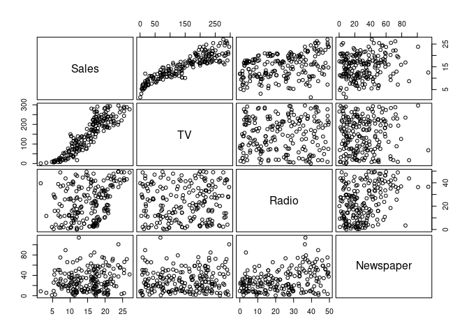
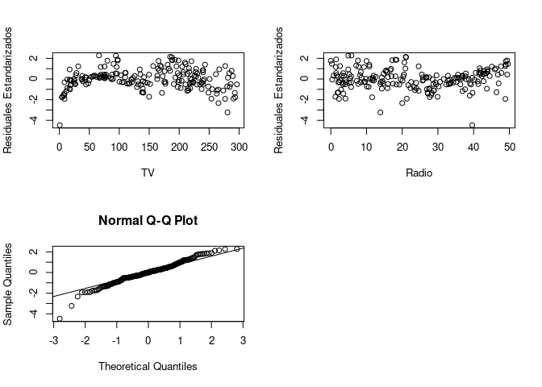

Postwork_6
================
Nieves
2022-12-07

Supongamos que nuestro trabajo consiste en aconsejar a un cliente sobre
como mejorar las ventas de un producto particular, y el conjunto de
datos con el que disponemos son datos de publicidad que consisten en las
ventas de aquel producto en 200 diferentes mercados, junto con
presupuestos de publicidad para el producto en cada uno de aquellos
mercados para tres medios de comunicación diferentes: TV, radio, y
periódico. No es posible para nuestro cliente incrementar directamente
las ventas del producto. Por otro lado, ellos pueden controlar el gasto
en publicidad para cada uno de los tres medios de comunicación. Por lo
tanto, si determinamos que hay una asociación entre publicidad y ventas,
entonces podemos instruir a nuestro cliente para que ajuste los
presupuestos de publicidad, y así indirectamente incrementar las ventas.

``` r
library(tidyverse)
```

    ## ── Attaching packages ─────────────────────────────────────── tidyverse 1.3.2 ──
    ## ✔ ggplot2 3.4.0      ✔ purrr   0.3.5 
    ## ✔ tibble  3.1.8      ✔ dplyr   1.0.10
    ## ✔ tidyr   1.2.1      ✔ stringr 1.4.1 
    ## ✔ readr   2.1.3      ✔ forcats 0.5.2 
    ## ── Conflicts ────────────────────────────────────────── tidyverse_conflicts() ──
    ## ✖ dplyr::filter() masks stats::filter()
    ## ✖ dplyr::lag()    masks stats::lag()

``` r
adv <- read.csv("https://raw.githubusercontent.com/beduExpert/Programacion-R-Santander-2022/main/Sesion-06/data/advertising.csv")
```

``` r
head(adv)
```

    ##      TV Radio Newspaper Sales
    ## 1 230.1  37.8      69.2  22.1
    ## 2  44.5  39.3      45.1  10.4
    ## 3  17.2  45.9      69.3  12.0
    ## 4 151.5  41.3      58.5  16.5
    ## 5 180.8  10.8      58.4  17.9
    ## 6   8.7  48.9      75.0   7.2

Reordenamos los datos para tener la variable dependiente en la primer
columna.

``` r
col_order <- c("Sales", "TV", "Radio","Newspaper")
```

``` r
adv2 <- adv[, col_order]
```

``` r
head(adv2)
```

    ##   Sales    TV Radio Newspaper
    ## 1  22.1 230.1  37.8      69.2
    ## 2  10.4  44.5  39.3      45.1
    ## 3  12.0  17.2  45.9      69.3
    ## 4  16.5 151.5  41.3      58.5
    ## 5  17.9 180.8  10.8      58.4
    ## 6   7.2   8.7  48.9      75.0

” Considera:

1.  Y: Sales (Ventas de un producto)
2.  X1: TV (Presupuesto de publicidad en TV para el producto)
3.  X2: Radio (Presupuesto de publicidad en Radio para el producto)
4.  X3: Newspaper (Presupuesto de publicidad en Periódico para el
    producto) ”

#### Obtenemos la matriz de correlación

``` r
round(cor(adv2),4)
```

    ##            Sales     TV  Radio Newspaper
    ## Sales     1.0000 0.9012 0.3496    0.1580
    ## TV        0.9012 1.0000 0.0548    0.0566
    ## Radio     0.3496 0.0548 1.0000    0.3541
    ## Newspaper 0.1580 0.0566 0.3541    1.0000

“Las correlaciones entre Sales y Radio son bajas 0.3496 pero, son más
bajas aun para Sales y Newspaper por lo que muestra una correlación casi
nula.”

``` r
attach(adv2)
```

#### Graficamos la matriz de correlación

``` r
pairs(~ Sales + TV + Radio +  Newspaper, 
      data = adv2, gap = 0.4, cex.labels = 1.5, col = 4)
```

<!-- -->

#### El primer modelo es:

``` r
m1 <- lm(Sales ~ TV + Radio +  Newspaper)
```

``` r
summary(m1)
```

    ## 
    ## Call:
    ## lm(formula = Sales ~ TV + Radio + Newspaper)
    ## 
    ## Residuals:
    ##     Min      1Q  Median      3Q     Max 
    ## -7.3034 -0.8244 -0.0008  0.8976  3.7473 
    ## 
    ## Coefficients:
    ##              Estimate Std. Error t value Pr(>|t|)    
    ## (Intercept) 4.6251241  0.3075012  15.041   <2e-16 ***
    ## TV          0.0544458  0.0013752  39.592   <2e-16 ***
    ## Radio       0.1070012  0.0084896  12.604   <2e-16 ***
    ## Newspaper   0.0003357  0.0057881   0.058    0.954    
    ## ---
    ## Signif. codes:  0 '***' 0.001 '**' 0.01 '*' 0.05 '.' 0.1 ' ' 1
    ## 
    ## Residual standard error: 1.662 on 196 degrees of freedom
    ## Multiple R-squared:  0.9026, Adjusted R-squared:  0.9011 
    ## F-statistic: 605.4 on 3 and 196 DF,  p-value: < 2.2e-16

1.  Ho $\beta_i =0$
2.  Ha: $\beta_i != 0$

R. Del resumen los p- values nos muestran que se rechaza la hipotesis
nula, Ho a favor de la hipotesis alternativa tanto para TV y Radio. La R
ajustada al cuadrado es 0.9011, en cueanto a la variable newspaper
podemos aceptar la hipotesis nula y no nos proporciona mucha
información, por lo que podemos probar el ajuste sin esta.

#### El segundo modelo es

``` r
m2 <- update(m1,~ .-Newspaper)
```

``` r
summary(m2)
```

    ## 
    ## Call:
    ## lm(formula = Sales ~ TV + Radio)
    ## 
    ## Residuals:
    ##     Min      1Q  Median      3Q     Max 
    ## -7.3131 -0.8269  0.0095  0.9022  3.7484 
    ## 
    ## Coefficients:
    ##             Estimate Std. Error t value Pr(>|t|)    
    ## (Intercept) 4.630879   0.290308   15.95   <2e-16 ***
    ## TV          0.054449   0.001371   39.73   <2e-16 ***
    ## Radio       0.107175   0.007926   13.52   <2e-16 ***
    ## ---
    ## Signif. codes:  0 '***' 0.001 '**' 0.01 '*' 0.05 '.' 0.1 ' ' 1
    ## 
    ## Residual standard error: 1.657 on 197 degrees of freedom
    ## Multiple R-squared:  0.9026, Adjusted R-squared:  0.9016 
    ## F-statistic: 912.7 on 2 and 197 DF,  p-value: < 2.2e-16

Para este modelo tambien se rechaza la hipotesis nula a favor de la
hipotesis alternativa y el r cuadrado ajustado nos da de 0.9016,
incremento en el ultimo digito por lo que podriamos considerar que es
mejor que el anterior, pero no lo suficiente

#### El tercer modelo es

``` r
m3 <- update(m2,~ .-Radio)
```

``` r
summary(m3)
```

    ## 
    ## Call:
    ## lm(formula = Sales ~ TV)
    ## 
    ## Residuals:
    ##     Min      1Q  Median      3Q     Max 
    ## -6.4438 -1.4857  0.0218  1.5042  5.6932 
    ## 
    ## Coefficients:
    ##             Estimate Std. Error t value Pr(>|t|)    
    ## (Intercept) 6.974821   0.322553   21.62   <2e-16 ***
    ## TV          0.055465   0.001896   29.26   <2e-16 ***
    ## ---
    ## Signif. codes:  0 '***' 0.001 '**' 0.01 '*' 0.05 '.' 0.1 ' ' 1
    ## 
    ## Residual standard error: 2.296 on 198 degrees of freedom
    ## Multiple R-squared:  0.8122, Adjusted R-squared:  0.8112 
    ## F-statistic: 856.2 on 1 and 198 DF,  p-value: < 2.2e-16

“En este caso el r ajustado disminuye considerablemente, por lo que
podemos descartar definitivamente este modelo”

Mi recomendación al cliente, seria que invierta mas presupuesto en
publicidad para TV y en radio en menor medida, dejando de fuera el
periodico.

``` r
StanRes2 <- rstandard(m2) 
```

``` r
par(mfrow = c(2, 2))

plot(TV, StanRes2, ylab = "Residuales Estandarizados")
plot(Radio, StanRes2, ylab = "Residuales Estandarizados")
qqnorm(StanRes2)
qqline(StanRes2, col = "red")
```

<!-- -->

R. como podemos ver la linea teorica coincide con los graficos, lo que
podemos decir que la distribucion es casi normal.

``` r
shapiro.test(StanRes2)
```

    ## 
    ##  Shapiro-Wilk normality test
    ## 
    ## data:  StanRes2
    ## W = 0.97535, p-value = 0.001365

1.  Ho: La variable distribuye como una normal
2.  Ha: La variable no distribuye como una normal

R. De esta prueba podemos concluir que la variable no se distribuye como
una normal.
