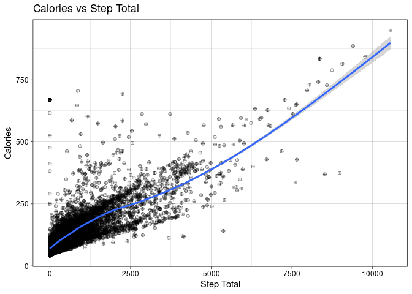
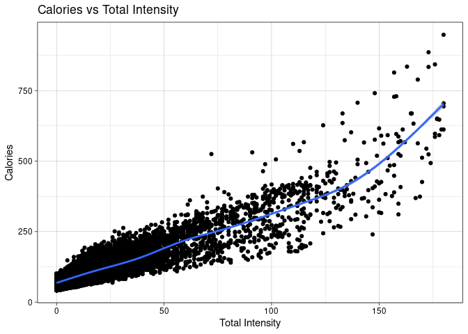
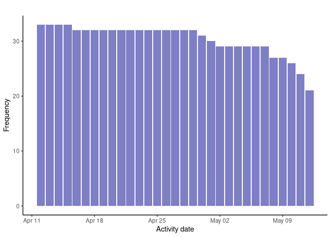

Bellabeat_analisys
================
Nieves
2022-11-25

## Preguntar

Identifica el problema

Analizar los datos de los dispositivos inteligentes para conocer el uso
que hacen los consumidores de sus dispositivos inteligentes y poder
aplicarlo a los productos de Bellabeat.

### Interesados

- Urška Sršen: Cofundadora y directora creativa de Bellabeat
- Sando Mur: Matemático y cofundador de Bellabeat, miembro clave del
  equipo ejecutivo de Bellabeat.
- Equipo de análisis computacional de datos de marketing de Bellabeat:

## Preparar

Vamos a hacer uso de los datos que nos proporcionan en el caso practico
2, los datos se guardaron en una subcarpeta de nombre “Fitabase_Data”,
en la carpeta de “caso_practico”. Para todo el proceso de análisis se
hará uso de el lenguaje de programación R.

Empezamos con la instalación de librerías que se requieren, en caso de
que ya se encuentren instaladas, omitimos este paso.

``` r
install.packages("tidyverse")
```

    ## Installing package into '/cloud/lib/x86_64-pc-linux-gnu-library/4.2'
    ## (as 'lib' is unspecified)

``` r
install.packages("lubridate")
```

    ## Installing package into '/cloud/lib/x86_64-pc-linux-gnu-library/4.2'
    ## (as 'lib' is unspecified)

Cargamos las librerías.

``` r
library(tidyverse)
```

    ## ── Attaching packages ─────────────────────────────────────── tidyverse 1.3.2 ──
    ## ✔ ggplot2 3.4.0      ✔ purrr   0.3.5 
    ## ✔ tibble  3.1.8      ✔ dplyr   1.0.10
    ## ✔ tidyr   1.2.1      ✔ stringr 1.4.1 
    ## ✔ readr   2.1.3      ✔ forcats 0.5.2 
    ## ── Conflicts ────────────────────────────────────────── tidyverse_conflicts() ──
    ## ✖ dplyr::filter() masks stats::filter()
    ## ✖ dplyr::lag()    masks stats::lag()

``` r
library(lubridate)
```

    ## Loading required package: timechange
    ## 
    ## Attaching package: 'lubridate'
    ## 
    ## The following objects are masked from 'package:base':
    ## 
    ##     date, intersect, setdiff, union

Revisamos como se organizan los datos, con los siguientes comandos, la
primera linea nos ayuda a hacer una lista con todos los archivos que
tenemos para analizar. Posteriormente los leemos con ayuda de la función
lapply y podemos ver un resumen de cada archivo.

``` r
temp = list.files(path = "2022_11_25_Bellabeat_data/",pattern="*.csv", full.names = T) 
myfiles <- lapply(temp, read.csv, header =TRUE)
lapply(X = myfiles,  summary)
```

    ## [[1]]
    ##        Id            ActivityDate         TotalSteps    TotalDistance   
    ##  Min.   :1.504e+09   Length:940         Min.   :    0   Min.   : 0.000  
    ##  1st Qu.:2.320e+09   Class :character   1st Qu.: 3790   1st Qu.: 2.620  
    ##  Median :4.445e+09   Mode  :character   Median : 7406   Median : 5.245  
    ##  Mean   :4.855e+09                      Mean   : 7638   Mean   : 5.490  
    ##  3rd Qu.:6.962e+09                      3rd Qu.:10727   3rd Qu.: 7.713  
    ##  Max.   :8.878e+09                      Max.   :36019   Max.   :28.030  
    ##  TrackerDistance  LoggedActivitiesDistance VeryActiveDistance
    ##  Min.   : 0.000   Min.   :0.0000           Min.   : 0.000    
    ##  1st Qu.: 2.620   1st Qu.:0.0000           1st Qu.: 0.000    
    ##  Median : 5.245   Median :0.0000           Median : 0.210    
    ##  Mean   : 5.475   Mean   :0.1082           Mean   : 1.503    
    ##  3rd Qu.: 7.710   3rd Qu.:0.0000           3rd Qu.: 2.053    
    ##  Max.   :28.030   Max.   :4.9421           Max.   :21.920    
    ##  ModeratelyActiveDistance LightActiveDistance SedentaryActiveDistance
    ##  Min.   :0.0000           Min.   : 0.000      Min.   :0.000000       
    ##  1st Qu.:0.0000           1st Qu.: 1.945      1st Qu.:0.000000       
    ##  Median :0.2400           Median : 3.365      Median :0.000000       
    ##  Mean   :0.5675           Mean   : 3.341      Mean   :0.001606       
    ##  3rd Qu.:0.8000           3rd Qu.: 4.782      3rd Qu.:0.000000       
    ##  Max.   :6.4800           Max.   :10.710      Max.   :0.110000       
    ##  VeryActiveMinutes FairlyActiveMinutes LightlyActiveMinutes SedentaryMinutes
    ##  Min.   :  0.00    Min.   :  0.00      Min.   :  0.0        Min.   :   0.0  
    ##  1st Qu.:  0.00    1st Qu.:  0.00      1st Qu.:127.0        1st Qu.: 729.8  
    ##  Median :  4.00    Median :  6.00      Median :199.0        Median :1057.5  
    ##  Mean   : 21.16    Mean   : 13.56      Mean   :192.8        Mean   : 991.2  
    ##  3rd Qu.: 32.00    3rd Qu.: 19.00      3rd Qu.:264.0        3rd Qu.:1229.5  
    ##  Max.   :210.00    Max.   :143.00      Max.   :518.0        Max.   :1440.0  
    ##     Calories   
    ##  Min.   :   0  
    ##  1st Qu.:1828  
    ##  Median :2134  
    ##  Mean   :2304  
    ##  3rd Qu.:2793  
    ##  Max.   :4900  
    ## 
    ## [[2]]
    ##        Id            ActivityDay           Calories   
    ##  Min.   :1.504e+09   Length:940         Min.   :   0  
    ##  1st Qu.:2.320e+09   Class :character   1st Qu.:1828  
    ##  Median :4.445e+09   Mode  :character   Median :2134  
    ##  Mean   :4.855e+09                      Mean   :2304  
    ##  3rd Qu.:6.962e+09                      3rd Qu.:2793  
    ##  Max.   :8.878e+09                      Max.   :4900  
    ## 
    ## [[3]]
    ##        Id            ActivityDay        SedentaryMinutes LightlyActiveMinutes
    ##  Min.   :1.504e+09   Length:940         Min.   :   0.0   Min.   :  0.0       
    ##  1st Qu.:2.320e+09   Class :character   1st Qu.: 729.8   1st Qu.:127.0       
    ##  Median :4.445e+09   Mode  :character   Median :1057.5   Median :199.0       
    ##  Mean   :4.855e+09                      Mean   : 991.2   Mean   :192.8       
    ##  3rd Qu.:6.962e+09                      3rd Qu.:1229.5   3rd Qu.:264.0       
    ##  Max.   :8.878e+09                      Max.   :1440.0   Max.   :518.0       
    ##  FairlyActiveMinutes VeryActiveMinutes SedentaryActiveDistance
    ##  Min.   :  0.00      Min.   :  0.00    Min.   :0.000000       
    ##  1st Qu.:  0.00      1st Qu.:  0.00    1st Qu.:0.000000       
    ##  Median :  6.00      Median :  4.00    Median :0.000000       
    ##  Mean   : 13.56      Mean   : 21.16    Mean   :0.001606       
    ##  3rd Qu.: 19.00      3rd Qu.: 32.00    3rd Qu.:0.000000       
    ##  Max.   :143.00      Max.   :210.00    Max.   :0.110000       
    ##  LightActiveDistance ModeratelyActiveDistance VeryActiveDistance
    ##  Min.   : 0.000      Min.   :0.0000           Min.   : 0.000    
    ##  1st Qu.: 1.945      1st Qu.:0.0000           1st Qu.: 0.000    
    ##  Median : 3.365      Median :0.2400           Median : 0.210    
    ##  Mean   : 3.341      Mean   :0.5675           Mean   : 1.503    
    ##  3rd Qu.: 4.782      3rd Qu.:0.8000           3rd Qu.: 2.053    
    ##  Max.   :10.710      Max.   :6.4800           Max.   :21.920    
    ## 
    ## [[4]]
    ##        Id            ActivityDay          StepTotal    
    ##  Min.   :1.504e+09   Length:940         Min.   :    0  
    ##  1st Qu.:2.320e+09   Class :character   1st Qu.: 3790  
    ##  Median :4.445e+09   Mode  :character   Median : 7406  
    ##  Mean   :4.855e+09                      Mean   : 7638  
    ##  3rd Qu.:6.962e+09                      3rd Qu.:10727  
    ##  Max.   :8.878e+09                      Max.   :36019  
    ## 
    ## [[5]]
    ##        Id                Time               Value       
    ##  Min.   :2.022e+09   Length:2483658     Min.   : 36.00  
    ##  1st Qu.:4.388e+09   Class :character   1st Qu.: 63.00  
    ##  Median :5.554e+09   Mode  :character   Median : 73.00  
    ##  Mean   :5.514e+09                      Mean   : 77.33  
    ##  3rd Qu.:6.962e+09                      3rd Qu.: 88.00  
    ##  Max.   :8.878e+09                      Max.   :203.00  
    ## 
    ## [[6]]
    ##        Id            ActivityHour          Calories     
    ##  Min.   :1.504e+09   Length:22099       Min.   : 42.00  
    ##  1st Qu.:2.320e+09   Class :character   1st Qu.: 63.00  
    ##  Median :4.445e+09   Mode  :character   Median : 83.00  
    ##  Mean   :4.848e+09                      Mean   : 97.39  
    ##  3rd Qu.:6.962e+09                      3rd Qu.:108.00  
    ##  Max.   :8.878e+09                      Max.   :948.00  
    ## 
    ## [[7]]
    ##        Id            ActivityHour       TotalIntensity   AverageIntensity
    ##  Min.   :1.504e+09   Length:22099       Min.   :  0.00   Min.   :0.0000  
    ##  1st Qu.:2.320e+09   Class :character   1st Qu.:  0.00   1st Qu.:0.0000  
    ##  Median :4.445e+09   Mode  :character   Median :  3.00   Median :0.0500  
    ##  Mean   :4.848e+09                      Mean   : 12.04   Mean   :0.2006  
    ##  3rd Qu.:6.962e+09                      3rd Qu.: 16.00   3rd Qu.:0.2667  
    ##  Max.   :8.878e+09                      Max.   :180.00   Max.   :3.0000  
    ## 
    ## [[8]]
    ##        Id            ActivityHour         StepTotal      
    ##  Min.   :1.504e+09   Length:22099       Min.   :    0.0  
    ##  1st Qu.:2.320e+09   Class :character   1st Qu.:    0.0  
    ##  Median :4.445e+09   Mode  :character   Median :   40.0  
    ##  Mean   :4.848e+09                      Mean   :  320.2  
    ##  3rd Qu.:6.962e+09                      3rd Qu.:  357.0  
    ##  Max.   :8.878e+09                      Max.   :10554.0  
    ## 
    ## [[9]]
    ##        Id            ActivityMinute        Calories      
    ##  Min.   :1.504e+09   Length:1325580     Min.   : 0.0000  
    ##  1st Qu.:2.320e+09   Class :character   1st Qu.: 0.9357  
    ##  Median :4.445e+09   Mode  :character   Median : 1.2176  
    ##  Mean   :4.848e+09                      Mean   : 1.6231  
    ##  3rd Qu.:6.962e+09                      3rd Qu.: 1.4327  
    ##  Max.   :8.878e+09                      Max.   :19.7499  
    ## 
    ## [[10]]
    ##        Id            ActivityHour         Calories00        Calories01     
    ##  Min.   :1.504e+09   Length:21645       Min.   : 0.7027   Min.   : 0.7027  
    ##  1st Qu.:2.320e+09   Class :character   1st Qu.: 0.9357   1st Qu.: 0.9357  
    ##  Median :4.445e+09   Mode  :character   Median : 1.2176   Median : 1.2176  
    ##  Mean   :4.837e+09                      Mean   : 1.6226   Mean   : 1.6264  
    ##  3rd Qu.:6.962e+09                      3rd Qu.: 1.4327   3rd Qu.: 1.4327  
    ##  Max.   :8.878e+09                      Max.   :19.7273   Max.   :19.7273  
    ##    Calories02        Calories03        Calories04        Calories05     
    ##  Min.   : 0.7027   Min.   : 0.7027   Min.   : 0.7027   Min.   : 0.7027  
    ##  1st Qu.: 0.9377   1st Qu.: 0.9357   1st Qu.: 0.9357   1st Qu.: 0.9357  
    ##  Median : 1.2204   Median : 1.2185   Median : 1.2185   Median : 1.2185  
    ##  Mean   : 1.6378   Mean   : 1.6355   Mean   : 1.6380   Mean   : 1.6383  
    ##  3rd Qu.: 1.4327   3rd Qu.: 1.4327   3rd Qu.: 1.4327   3rd Qu.: 1.4327  
    ##  Max.   :19.7273   Max.   :19.7273   Max.   :19.7273   Max.   :19.7273  
    ##    Calories06        Calories07        Calories08        Calories09     
    ##  Min.   : 0.7027   Min.   : 0.7027   Min.   : 0.7027   Min.   : 0.7027  
    ##  1st Qu.: 0.9357   1st Qu.: 0.9357   1st Qu.: 0.9357   1st Qu.: 0.9357  
    ##  Median : 1.2185   Median : 1.2176   Median : 1.2176   Median : 1.2185  
    ##  Mean   : 1.6399   Mean   : 1.6295   Mean   : 1.6237   Mean   : 1.6226  
    ##  3rd Qu.: 1.4327   3rd Qu.: 1.4327   3rd Qu.: 1.4327   3rd Qu.: 1.4327  
    ##  Max.   :19.7273   Max.   :19.7273   Max.   :19.7273   Max.   :16.7578  
    ##    Calories10        Calories11        Calories12        Calories13     
    ##  Min.   : 0.7027   Min.   : 0.7027   Min.   : 0.7027   Min.   : 0.7027  
    ##  1st Qu.: 0.9357   1st Qu.: 0.9357   1st Qu.: 0.9357   1st Qu.: 0.9357  
    ##  Median : 1.2176   Median : 1.2176   Median : 1.2176   Median : 1.2176  
    ##  Mean   : 1.6212   Mean   : 1.6213   Mean   : 1.6147   Mean   : 1.6117  
    ##  3rd Qu.: 1.4327   3rd Qu.: 1.4327   3rd Qu.: 1.4327   3rd Qu.: 1.4327  
    ##  Max.   :17.4391   Max.   :16.7578   Max.   :17.4391   Max.   :16.6808  
    ##    Calories14        Calories15        Calories16        Calories17     
    ##  Min.   : 0.0000   Min.   : 0.7027   Min.   : 0.7027   Min.   : 0.7027  
    ##  1st Qu.: 0.9357   1st Qu.: 0.9357   1st Qu.: 0.9357   1st Qu.: 0.9357  
    ##  Median : 1.2176   Median : 1.2176   Median : 1.2176   Median : 1.2176  
    ##  Mean   : 1.6140   Mean   : 1.6124   Mean   : 1.6059   Mean   : 1.6127  
    ##  3rd Qu.: 1.4327   3rd Qu.: 1.4327   3rd Qu.: 1.4327   3rd Qu.: 1.4327  
    ##  Max.   :16.9336   Max.   :17.1863   Max.   :17.1863   Max.   :17.4391  
    ##    Calories18        Calories19        Calories20        Calories21     
    ##  Min.   : 0.7027   Min.   : 0.7027   Min.   : 0.7027   Min.   : 0.7027  
    ##  1st Qu.: 0.9357   1st Qu.: 0.9357   1st Qu.: 0.9357   1st Qu.: 0.9357  
    ##  Median : 1.2176   Median : 1.2176   Median : 1.2176   Median : 1.2176  
    ##  Mean   : 1.6143   Mean   : 1.6203   Mean   : 1.6151   Mean   : 1.6148  
    ##  3rd Qu.: 1.4327   3rd Qu.: 1.4327   3rd Qu.: 1.4327   3rd Qu.: 1.4327  
    ##  Max.   :16.9336   Max.   :16.6808   Max.   :16.3037   Max.   :16.8255  
    ##    Calories22        Calories23        Calories24        Calories25     
    ##  Min.   : 0.7027   Min.   : 0.7027   Min.   : 0.7027   Min.   : 0.0000  
    ##  1st Qu.: 0.9357   1st Qu.: 0.9357   1st Qu.: 0.9357   1st Qu.: 0.9357  
    ##  Median : 1.2176   Median : 1.2176   Median : 1.2176   Median : 1.2176  
    ##  Mean   : 1.6266   Mean   : 1.6173   Mean   : 1.6147   Mean   : 1.6151  
    ##  3rd Qu.: 1.4327   3rd Qu.: 1.4327   3rd Qu.: 1.4327   3rd Qu.: 1.4327  
    ##  Max.   :17.7799   Max.   :17.7799   Max.   :17.3472   Max.   :17.0863  
    ##    Calories26        Calories27        Calories28        Calories29     
    ##  Min.   : 0.7027   Min.   : 0.7027   Min.   : 0.7027   Min.   : 0.7027  
    ##  1st Qu.: 0.9357   1st Qu.: 0.9357   1st Qu.: 0.9357   1st Qu.: 0.9357  
    ##  Median : 1.2176   Median : 1.2176   Median : 1.2176   Median : 1.2176  
    ##  Mean   : 1.6136   Mean   : 1.6157   Mean   : 1.6180   Mean   : 1.6234  
    ##  3rd Qu.: 1.4327   3rd Qu.: 1.4327   3rd Qu.: 1.4327   3rd Qu.: 1.4327  
    ##  Max.   :16.9858   Max.   :17.2302   Max.   :16.8255   Max.   :17.3472  
    ##    Calories30        Calories31        Calories32        Calories33     
    ##  Min.   : 0.7027   Min.   : 0.7027   Min.   : 0.7027   Min.   : 0.7027  
    ##  1st Qu.: 0.9357   1st Qu.: 0.9357   1st Qu.: 0.9357   1st Qu.: 0.9357  
    ##  Median : 1.2176   Median : 1.2185   Median : 1.2176   Median : 1.2176  
    ##  Mean   : 1.6238   Mean   : 1.6252   Mean   : 1.6331   Mean   : 1.6378  
    ##  3rd Qu.: 1.4327   3rd Qu.: 1.4327   3rd Qu.: 1.4327   3rd Qu.: 1.4327  
    ##  Max.   :17.3472   Max.   :17.6080   Max.   :17.6080   Max.   :17.6080  
    ##    Calories34        Calories35        Calories36        Calories37     
    ##  Min.   : 0.7027   Min.   : 0.7027   Min.   : 0.7027   Min.   : 0.7027  
    ##  1st Qu.: 0.9357   1st Qu.: 0.9357   1st Qu.: 0.9357   1st Qu.: 0.9357  
    ##  Median : 1.2176   Median : 1.2185   Median : 1.2185   Median : 1.2176  
    ##  Mean   : 1.6330   Mean   : 1.6338   Mean   : 1.6412   Mean   : 1.6366  
    ##  3rd Qu.: 1.4327   3rd Qu.: 1.4327   3rd Qu.: 1.4327   3rd Qu.: 1.4327  
    ##  Max.   :17.8689   Max.   :17.8689   Max.   :19.7499   Max.   :19.7499  
    ##    Calories38        Calories39        Calories40        Calories41     
    ##  Min.   : 0.7027   Min.   : 0.7027   Min.   : 0.7027   Min.   : 0.7027  
    ##  1st Qu.: 0.9357   1st Qu.: 0.9357   1st Qu.: 0.9357   1st Qu.: 0.9357  
    ##  Median : 1.2176   Median : 1.2176   Median : 1.2176   Median : 1.2176  
    ##  Mean   : 1.6304   Mean   : 1.6284   Mean   : 1.6261   Mean   : 1.6234  
    ##  3rd Qu.: 1.4327   3rd Qu.: 1.4327   3rd Qu.: 1.4327   3rd Qu.: 1.4327  
    ##  Max.   :19.7499   Max.   :19.7499   Max.   :19.7499   Max.   :19.7499  
    ##    Calories42        Calories43        Calories44        Calories45     
    ##  Min.   : 0.7027   Min.   : 0.7027   Min.   : 0.7027   Min.   : 0.7027  
    ##  1st Qu.: 0.9357   1st Qu.: 0.9357   1st Qu.: 0.9357   1st Qu.: 0.9357  
    ##  Median : 1.2176   Median : 1.2176   Median : 1.2176   Median : 1.2176  
    ##  Mean   : 1.6157   Mean   : 1.6212   Mean   : 1.6224   Mean   : 1.6178  
    ##  3rd Qu.: 1.4327   3rd Qu.: 1.4327   3rd Qu.: 1.4327   3rd Qu.: 1.4327  
    ##  Max.   :19.7499   Max.   :19.7499   Max.   :19.7499   Max.   :19.7499  
    ##    Calories46        Calories47        Calories48        Calories49     
    ##  Min.   : 0.7027   Min.   : 0.7027   Min.   : 0.7027   Min.   : 0.7027  
    ##  1st Qu.: 0.9357   1st Qu.: 0.9357   1st Qu.: 0.9357   1st Qu.: 0.9357  
    ##  Median : 1.2176   Median : 1.2176   Median : 1.2176   Median : 1.2176  
    ##  Mean   : 1.6169   Mean   : 1.6185   Mean   : 1.6167   Mean   : 1.6197  
    ##  3rd Qu.: 1.4327   3rd Qu.: 1.4327   3rd Qu.: 1.4327   3rd Qu.: 1.4327  
    ##  Max.   :19.7499   Max.   :19.7499   Max.   :19.7499   Max.   :19.7499  
    ##    Calories50        Calories51        Calories52        Calories53     
    ##  Min.   : 0.7027   Min.   : 0.7027   Min.   : 0.7027   Min.   : 0.7027  
    ##  1st Qu.: 0.9357   1st Qu.: 0.9357   1st Qu.: 0.9357   1st Qu.: 0.9357  
    ##  Median : 1.2176   Median : 1.2176   Median : 1.2176   Median : 1.2176  
    ##  Mean   : 1.6237   Mean   : 1.6136   Mean   : 1.6210   Mean   : 1.6182  
    ##  3rd Qu.: 1.4327   3rd Qu.: 1.4327   3rd Qu.: 1.4327   3rd Qu.: 1.4327  
    ##  Max.   :19.7499   Max.   :19.7499   Max.   :19.7499   Max.   :19.7499  
    ##    Calories54        Calories55        Calories56        Calories57     
    ##  Min.   : 0.7027   Min.   : 0.7027   Min.   : 0.7027   Min.   : 0.7027  
    ##  1st Qu.: 0.9357   1st Qu.: 0.9357   1st Qu.: 0.9357   1st Qu.: 0.9357  
    ##  Median : 1.2176   Median : 1.2176   Median : 1.2176   Median : 1.2176  
    ##  Mean   : 1.6212   Mean   : 1.6160   Mean   : 1.6087   Mean   : 1.6127  
    ##  3rd Qu.: 1.4327   3rd Qu.: 1.4327   3rd Qu.: 1.4327   3rd Qu.: 1.4327  
    ##  Max.   :19.7499   Max.   :19.7499   Max.   :19.7273   Max.   :19.7273  
    ##    Calories58        Calories59     
    ##  Min.   : 0.7027   Min.   : 0.0000  
    ##  1st Qu.: 0.9357   1st Qu.: 0.9357  
    ##  Median : 1.2176   Median : 1.2176  
    ##  Mean   : 1.6117   Mean   : 1.6121  
    ##  3rd Qu.: 1.4327   3rd Qu.: 1.4327  
    ##  Max.   :19.7273   Max.   :19.7273  
    ## 
    ## [[11]]
    ##        Id            ActivityMinute       Intensity     
    ##  Min.   :1.504e+09   Length:1325580     Min.   :0.0000  
    ##  1st Qu.:2.320e+09   Class :character   1st Qu.:0.0000  
    ##  Median :4.445e+09   Mode  :character   Median :0.0000  
    ##  Mean   :4.848e+09                      Mean   :0.2006  
    ##  3rd Qu.:6.962e+09                      3rd Qu.:0.0000  
    ##  Max.   :8.878e+09                      Max.   :3.0000  
    ## 
    ## [[12]]
    ##        Id            ActivityHour        Intensity00      Intensity01    
    ##  Min.   :1.504e+09   Length:21645       Min.   :0.0000   Min.   :0.0000  
    ##  1st Qu.:2.320e+09   Class :character   1st Qu.:0.0000   1st Qu.:0.0000  
    ##  Median :4.445e+09   Mode  :character   Median :0.0000   Median :0.0000  
    ##  Mean   :4.837e+09                      Mean   :0.1997   Mean   :0.2033  
    ##  3rd Qu.:6.962e+09                      3rd Qu.:0.0000   3rd Qu.:0.0000  
    ##  Max.   :8.878e+09                      Max.   :3.0000   Max.   :3.0000  
    ##   Intensity02      Intensity03      Intensity04      Intensity05    
    ##  Min.   :0.0000   Min.   :0.0000   Min.   :0.0000   Min.   :0.0000  
    ##  1st Qu.:0.0000   1st Qu.:0.0000   1st Qu.:0.0000   1st Qu.:0.0000  
    ##  Median :0.0000   Median :0.0000   Median :0.0000   Median :0.0000  
    ##  Mean   :0.2082   Mean   :0.2038   Mean   :0.2051   Mean   :0.2049  
    ##  3rd Qu.:0.0000   3rd Qu.:0.0000   3rd Qu.:0.0000   3rd Qu.:0.0000  
    ##  Max.   :3.0000   Max.   :3.0000   Max.   :3.0000   Max.   :3.0000  
    ##   Intensity06      Intensity07      Intensity08      Intensity09    
    ##  Min.   :0.0000   Min.   :0.0000   Min.   :0.0000   Min.   :0.0000  
    ##  1st Qu.:0.0000   1st Qu.:0.0000   1st Qu.:0.0000   1st Qu.:0.0000  
    ##  Median :0.0000   Median :0.0000   Median :0.0000   Median :0.0000  
    ##  Mean   :0.2066   Mean   :0.2019   Mean   :0.2023   Mean   :0.2021  
    ##  3rd Qu.:0.0000   3rd Qu.:0.0000   3rd Qu.:0.0000   3rd Qu.:0.0000  
    ##  Max.   :3.0000   Max.   :3.0000   Max.   :3.0000   Max.   :3.0000  
    ##   Intensity10      Intensity11      Intensity12   Intensity13    
    ##  Min.   :0.0000   Min.   :0.0000   Min.   :0.0   Min.   :0.0000  
    ##  1st Qu.:0.0000   1st Qu.:0.0000   1st Qu.:0.0   1st Qu.:0.0000  
    ##  Median :0.0000   Median :0.0000   Median :0.0   Median :0.0000  
    ##  Mean   :0.2014   Mean   :0.2022   Mean   :0.2   Mean   :0.1978  
    ##  3rd Qu.:0.0000   3rd Qu.:0.0000   3rd Qu.:0.0   3rd Qu.:0.0000  
    ##  Max.   :3.0000   Max.   :3.0000   Max.   :3.0   Max.   :3.0000  
    ##   Intensity14      Intensity15      Intensity16      Intensity17    
    ##  Min.   :0.0000   Min.   :0.0000   Min.   :0.0000   Min.   :0.0000  
    ##  1st Qu.:0.0000   1st Qu.:0.0000   1st Qu.:0.0000   1st Qu.:0.0000  
    ##  Median :0.0000   Median :0.0000   Median :0.0000   Median :0.0000  
    ##  Mean   :0.2002   Mean   :0.1983   Mean   :0.1938   Mean   :0.1976  
    ##  3rd Qu.:0.0000   3rd Qu.:0.0000   3rd Qu.:0.0000   3rd Qu.:0.0000  
    ##  Max.   :3.0000   Max.   :3.0000   Max.   :3.0000   Max.   :3.0000  
    ##   Intensity18      Intensity19      Intensity20      Intensity21    
    ##  Min.   :0.0000   Min.   :0.0000   Min.   :0.0000   Min.   :0.0000  
    ##  1st Qu.:0.0000   1st Qu.:0.0000   1st Qu.:0.0000   1st Qu.:0.0000  
    ##  Median :0.0000   Median :0.0000   Median :0.0000   Median :0.0000  
    ##  Mean   :0.1996   Mean   :0.2017   Mean   :0.1998   Mean   :0.1998  
    ##  3rd Qu.:0.0000   3rd Qu.:0.0000   3rd Qu.:0.0000   3rd Qu.:0.0000  
    ##  Max.   :3.0000   Max.   :3.0000   Max.   :3.0000   Max.   :3.0000  
    ##   Intensity22      Intensity23      Intensity24      Intensity25    
    ##  Min.   :0.0000   Min.   :0.0000   Min.   :0.0000   Min.   :0.0000  
    ##  1st Qu.:0.0000   1st Qu.:0.0000   1st Qu.:0.0000   1st Qu.:0.0000  
    ##  Median :0.0000   Median :0.0000   Median :0.0000   Median :0.0000  
    ##  Mean   :0.2047   Mean   :0.1998   Mean   :0.1974   Mean   :0.1963  
    ##  3rd Qu.:0.0000   3rd Qu.:0.0000   3rd Qu.:0.0000   3rd Qu.:0.0000  
    ##  Max.   :3.0000   Max.   :3.0000   Max.   :3.0000   Max.   :3.0000  
    ##   Intensity26      Intensity27      Intensity28      Intensity29    
    ##  Min.   :0.0000   Min.   :0.0000   Min.   :0.0000   Min.   :0.0000  
    ##  1st Qu.:0.0000   1st Qu.:0.0000   1st Qu.:0.0000   1st Qu.:0.0000  
    ##  Median :0.0000   Median :0.0000   Median :0.0000   Median :0.0000  
    ##  Mean   :0.1985   Mean   :0.1986   Mean   :0.1989   Mean   :0.2021  
    ##  3rd Qu.:0.0000   3rd Qu.:0.0000   3rd Qu.:0.0000   3rd Qu.:0.0000  
    ##  Max.   :3.0000   Max.   :3.0000   Max.   :3.0000   Max.   :3.0000  
    ##   Intensity30      Intensity31      Intensity32      Intensity33    
    ##  Min.   :0.0000   Min.   :0.0000   Min.   :0.0000   Min.   :0.0000  
    ##  1st Qu.:0.0000   1st Qu.:0.0000   1st Qu.:0.0000   1st Qu.:0.0000  
    ##  Median :0.0000   Median :0.0000   Median :0.0000   Median :0.0000  
    ##  Mean   :0.2016   Mean   :0.2033   Mean   :0.2056   Mean   :0.2059  
    ##  3rd Qu.:0.0000   3rd Qu.:0.0000   3rd Qu.:0.0000   3rd Qu.:0.0000  
    ##  Max.   :3.0000   Max.   :3.0000   Max.   :3.0000   Max.   :3.0000  
    ##   Intensity34      Intensity35      Intensity36      Intensity37    
    ##  Min.   :0.0000   Min.   :0.0000   Min.   :0.0000   Min.   :0.0000  
    ##  1st Qu.:0.0000   1st Qu.:0.0000   1st Qu.:0.0000   1st Qu.:0.0000  
    ##  Median :0.0000   Median :0.0000   Median :0.0000   Median :0.0000  
    ##  Mean   :0.2044   Mean   :0.2066   Mean   :0.2072   Mean   :0.2057  
    ##  3rd Qu.:0.0000   3rd Qu.:0.0000   3rd Qu.:0.0000   3rd Qu.:0.0000  
    ##  Max.   :3.0000   Max.   :3.0000   Max.   :3.0000   Max.   :3.0000  
    ##   Intensity38      Intensity39      Intensity40     Intensity41    
    ##  Min.   :0.0000   Min.   :0.0000   Min.   :0.000   Min.   :0.0000  
    ##  1st Qu.:0.0000   1st Qu.:0.0000   1st Qu.:0.000   1st Qu.:0.0000  
    ##  Median :0.0000   Median :0.0000   Median :0.000   Median :0.0000  
    ##  Mean   :0.2018   Mean   :0.2031   Mean   :0.203   Mean   :0.2026  
    ##  3rd Qu.:0.0000   3rd Qu.:0.0000   3rd Qu.:0.000   3rd Qu.:0.0000  
    ##  Max.   :3.0000   Max.   :3.0000   Max.   :3.000   Max.   :3.0000  
    ##   Intensity42      Intensity43      Intensity44      Intensity45    
    ##  Min.   :0.0000   Min.   :0.0000   Min.   :0.0000   Min.   :0.0000  
    ##  1st Qu.:0.0000   1st Qu.:0.0000   1st Qu.:0.0000   1st Qu.:0.0000  
    ##  Median :0.0000   Median :0.0000   Median :0.0000   Median :0.0000  
    ##  Mean   :0.1983   Mean   :0.2008   Mean   :0.2006   Mean   :0.2001  
    ##  3rd Qu.:0.0000   3rd Qu.:0.0000   3rd Qu.:0.0000   3rd Qu.:0.0000  
    ##  Max.   :3.0000   Max.   :3.0000   Max.   :3.0000   Max.   :3.0000  
    ##   Intensity46      Intensity47      Intensity48      Intensity49   
    ##  Min.   :0.0000   Min.   :0.0000   Min.   :0.0000   Min.   :0.000  
    ##  1st Qu.:0.0000   1st Qu.:0.0000   1st Qu.:0.0000   1st Qu.:0.000  
    ##  Median :0.0000   Median :0.0000   Median :0.0000   Median :0.000  
    ##  Mean   :0.1975   Mean   :0.1976   Mean   :0.1993   Mean   :0.199  
    ##  3rd Qu.:0.0000   3rd Qu.:0.0000   3rd Qu.:0.0000   3rd Qu.:0.000  
    ##  Max.   :3.0000   Max.   :3.0000   Max.   :3.0000   Max.   :3.000  
    ##   Intensity50     Intensity51      Intensity52      Intensity53    
    ##  Min.   :0.000   Min.   :0.0000   Min.   :0.0000   Min.   :0.0000  
    ##  1st Qu.:0.000   1st Qu.:0.0000   1st Qu.:0.0000   1st Qu.:0.0000  
    ##  Median :0.000   Median :0.0000   Median :0.0000   Median :0.0000  
    ##  Mean   :0.201   Mean   :0.1958   Mean   :0.1983   Mean   :0.1994  
    ##  3rd Qu.:0.000   3rd Qu.:0.0000   3rd Qu.:0.0000   3rd Qu.:0.0000  
    ##  Max.   :3.000   Max.   :3.0000   Max.   :3.0000   Max.   :3.0000  
    ##   Intensity54      Intensity55      Intensity56      Intensity57    
    ##  Min.   :0.0000   Min.   :0.0000   Min.   :0.0000   Min.   :0.0000  
    ##  1st Qu.:0.0000   1st Qu.:0.0000   1st Qu.:0.0000   1st Qu.:0.0000  
    ##  Median :0.0000   Median :0.0000   Median :0.0000   Median :0.0000  
    ##  Mean   :0.2001   Mean   :0.1988   Mean   :0.1956   Mean   :0.1991  
    ##  3rd Qu.:0.0000   3rd Qu.:0.0000   3rd Qu.:0.0000   3rd Qu.:0.0000  
    ##  Max.   :3.0000   Max.   :3.0000   Max.   :3.0000   Max.   :3.0000  
    ##   Intensity58      Intensity59    
    ##  Min.   :0.0000   Min.   :0.0000  
    ##  1st Qu.:0.0000   1st Qu.:0.0000  
    ##  Median :0.0000   Median :0.0000  
    ##  Mean   :0.1982   Mean   :0.1954  
    ##  3rd Qu.:0.0000   3rd Qu.:0.0000  
    ##  Max.   :3.0000   Max.   :3.0000  
    ## 
    ## [[13]]
    ##        Id            ActivityMinute          METs       
    ##  Min.   :1.504e+09   Length:1325580     Min.   :  0.00  
    ##  1st Qu.:2.320e+09   Class :character   1st Qu.: 10.00  
    ##  Median :4.445e+09   Mode  :character   Median : 10.00  
    ##  Mean   :4.848e+09                      Mean   : 14.69  
    ##  3rd Qu.:6.962e+09                      3rd Qu.: 11.00  
    ##  Max.   :8.878e+09                      Max.   :157.00  
    ## 
    ## [[14]]
    ##        Id                date               value           logId          
    ##  Min.   :1.504e+09   Length:188521      Min.   :1.000   Min.   :1.137e+10  
    ##  1st Qu.:3.977e+09   Class :character   1st Qu.:1.000   1st Qu.:1.144e+10  
    ##  Median :4.703e+09   Mode  :character   Median :1.000   Median :1.150e+10  
    ##  Mean   :4.997e+09                      Mean   :1.096   Mean   :1.150e+10  
    ##  3rd Qu.:6.962e+09                      3rd Qu.:1.000   3rd Qu.:1.155e+10  
    ##  Max.   :8.792e+09                      Max.   :3.000   Max.   :1.162e+10  
    ## 
    ## [[15]]
    ##        Id            ActivityMinute         Steps        
    ##  Min.   :1.504e+09   Length:1325580     Min.   :  0.000  
    ##  1st Qu.:2.320e+09   Class :character   1st Qu.:  0.000  
    ##  Median :4.445e+09   Mode  :character   Median :  0.000  
    ##  Mean   :4.848e+09                      Mean   :  5.336  
    ##  3rd Qu.:6.962e+09                      3rd Qu.:  0.000  
    ##  Max.   :8.878e+09                      Max.   :220.000  
    ## 
    ## [[16]]
    ##        Id            ActivityHour          Steps00           Steps01       
    ##  Min.   :1.504e+09   Length:21645       Min.   :  0.000   Min.   :  0.000  
    ##  1st Qu.:2.320e+09   Class :character   1st Qu.:  0.000   1st Qu.:  0.000  
    ##  Median :4.445e+09   Mode  :character   Median :  0.000   Median :  0.000  
    ##  Mean   :4.837e+09                      Mean   :  5.304   Mean   :  5.335  
    ##  3rd Qu.:6.962e+09                      3rd Qu.:  0.000   3rd Qu.:  0.000  
    ##  Max.   :8.878e+09                      Max.   :186.000   Max.   :180.000  
    ##     Steps02           Steps03           Steps04           Steps05      
    ##  Min.   :  0.000   Min.   :  0.000   Min.   :  0.000   Min.   :  0.00  
    ##  1st Qu.:  0.000   1st Qu.:  0.000   1st Qu.:  0.000   1st Qu.:  0.00  
    ##  Median :  0.000   Median :  0.000   Median :  0.000   Median :  0.00  
    ##  Mean   :  5.531   Mean   :  5.469   Mean   :  5.462   Mean   :  5.59  
    ##  3rd Qu.:  0.000   3rd Qu.:  0.000   3rd Qu.:  0.000   3rd Qu.:  0.00  
    ##  Max.   :182.000   Max.   :182.000   Max.   :181.000   Max.   :180.00  
    ##     Steps06           Steps07           Steps08           Steps09       
    ##  Min.   :  0.000   Min.   :  0.000   Min.   :  0.000   Min.   :  0.000  
    ##  1st Qu.:  0.000   1st Qu.:  0.000   1st Qu.:  0.000   1st Qu.:  0.000  
    ##  Median :  0.000   Median :  0.000   Median :  0.000   Median :  0.000  
    ##  Mean   :  5.559   Mean   :  5.412   Mean   :  5.359   Mean   :  5.359  
    ##  3rd Qu.:  0.000   3rd Qu.:  0.000   3rd Qu.:  0.000   3rd Qu.:  0.000  
    ##  Max.   :181.000   Max.   :183.000   Max.   :180.000   Max.   :183.000  
    ##     Steps10           Steps11          Steps12           Steps13       
    ##  Min.   :  0.000   Min.   :  0.00   Min.   :  0.000   Min.   :  0.000  
    ##  1st Qu.:  0.000   1st Qu.:  0.00   1st Qu.:  0.000   1st Qu.:  0.000  
    ##  Median :  0.000   Median :  0.00   Median :  0.000   Median :  0.000  
    ##  Mean   :  5.343   Mean   :  5.29   Mean   :  5.304   Mean   :  5.263  
    ##  3rd Qu.:  0.000   3rd Qu.:  0.00   3rd Qu.:  0.000   3rd Qu.:  0.000  
    ##  Max.   :180.000   Max.   :181.00   Max.   :181.000   Max.   :180.000  
    ##     Steps14           Steps15           Steps16           Steps17       
    ##  Min.   :  0.000   Min.   :  0.000   Min.   :  0.000   Min.   :  0.000  
    ##  1st Qu.:  0.000   1st Qu.:  0.000   1st Qu.:  0.000   1st Qu.:  0.000  
    ##  Median :  0.000   Median :  0.000   Median :  0.000   Median :  0.000  
    ##  Mean   :  5.344   Mean   :  5.276   Mean   :  5.207   Mean   :  5.286  
    ##  3rd Qu.:  0.000   3rd Qu.:  0.000   3rd Qu.:  0.000   3rd Qu.:  0.000  
    ##  Max.   :182.000   Max.   :179.000   Max.   :180.000   Max.   :183.000  
    ##     Steps18           Steps19           Steps20           Steps21      
    ##  Min.   :  0.000   Min.   :  0.000   Min.   :  0.000   Min.   :  0.00  
    ##  1st Qu.:  0.000   1st Qu.:  0.000   1st Qu.:  0.000   1st Qu.:  0.00  
    ##  Median :  0.000   Median :  0.000   Median :  0.000   Median :  0.00  
    ##  Mean   :  5.346   Mean   :  5.418   Mean   :  5.296   Mean   :  5.29  
    ##  3rd Qu.:  0.000   3rd Qu.:  0.000   3rd Qu.:  0.000   3rd Qu.:  0.00  
    ##  Max.   :180.000   Max.   :182.000   Max.   :179.000   Max.   :185.00  
    ##     Steps22           Steps23           Steps24           Steps25     
    ##  Min.   :  0.000   Min.   :  0.000   Min.   :  0.000   Min.   :  0.0  
    ##  1st Qu.:  0.000   1st Qu.:  0.000   1st Qu.:  0.000   1st Qu.:  0.0  
    ##  Median :  0.000   Median :  0.000   Median :  0.000   Median :  0.0  
    ##  Mean   :  5.535   Mean   :  5.349   Mean   :  5.311   Mean   :  5.3  
    ##  3rd Qu.:  0.000   3rd Qu.:  0.000   3rd Qu.:  0.000   3rd Qu.:  0.0  
    ##  Max.   :182.000   Max.   :187.000   Max.   :180.000   Max.   :181.0  
    ##     Steps26           Steps27           Steps28           Steps29       
    ##  Min.   :  0.000   Min.   :  0.000   Min.   :  0.000   Min.   :  0.000  
    ##  1st Qu.:  0.000   1st Qu.:  0.000   1st Qu.:  0.000   1st Qu.:  0.000  
    ##  Median :  0.000   Median :  0.000   Median :  0.000   Median :  0.000  
    ##  Mean   :  5.253   Mean   :  5.308   Mean   :  5.265   Mean   :  5.255  
    ##  3rd Qu.:  0.000   3rd Qu.:  0.000   3rd Qu.:  0.000   3rd Qu.:  0.000  
    ##  Max.   :186.000   Max.   :180.000   Max.   :181.000   Max.   :183.000  
    ##     Steps30           Steps31           Steps32           Steps33     
    ##  Min.   :  0.000   Min.   :  0.000   Min.   :  0.000   Min.   :  0.0  
    ##  1st Qu.:  0.000   1st Qu.:  0.000   1st Qu.:  0.000   1st Qu.:  0.0  
    ##  Median :  0.000   Median :  0.000   Median :  0.000   Median :  0.0  
    ##  Mean   :  5.395   Mean   :  5.363   Mean   :  5.436   Mean   :  5.5  
    ##  3rd Qu.:  0.000   3rd Qu.:  0.000   3rd Qu.:  0.000   3rd Qu.:  0.0  
    ##  Max.   :181.000   Max.   :181.000   Max.   :181.000   Max.   :182.0  
    ##     Steps34           Steps35           Steps36           Steps37       
    ##  Min.   :  0.000   Min.   :  0.000   Min.   :  0.000   Min.   :  0.000  
    ##  1st Qu.:  0.000   1st Qu.:  0.000   1st Qu.:  0.000   1st Qu.:  0.000  
    ##  Median :  0.000   Median :  0.000   Median :  0.000   Median :  0.000  
    ##  Mean   :  5.469   Mean   :  5.419   Mean   :  5.581   Mean   :  5.496  
    ##  3rd Qu.:  0.000   3rd Qu.:  0.000   3rd Qu.:  0.000   3rd Qu.:  0.000  
    ##  Max.   :180.000   Max.   :187.000   Max.   :183.000   Max.   :181.000  
    ##     Steps38           Steps39           Steps40           Steps41       
    ##  Min.   :  0.000   Min.   :  0.000   Min.   :  0.000   Min.   :  0.000  
    ##  1st Qu.:  0.000   1st Qu.:  0.000   1st Qu.:  0.000   1st Qu.:  0.000  
    ##  Median :  0.000   Median :  0.000   Median :  0.000   Median :  0.000  
    ##  Mean   :  5.484   Mean   :  5.337   Mean   :  5.381   Mean   :  5.343  
    ##  3rd Qu.:  0.000   3rd Qu.:  0.000   3rd Qu.:  0.000   3rd Qu.:  0.000  
    ##  Max.   :185.000   Max.   :184.000   Max.   :184.000   Max.   :184.000  
    ##     Steps42          Steps43           Steps44           Steps45       
    ##  Min.   :  0.00   Min.   :  0.000   Min.   :  0.000   Min.   :  0.000  
    ##  1st Qu.:  0.00   1st Qu.:  0.000   1st Qu.:  0.000   1st Qu.:  0.000  
    ##  Median :  0.00   Median :  0.000   Median :  0.000   Median :  0.000  
    ##  Mean   :  5.26   Mean   :  5.292   Mean   :  5.353   Mean   :  5.243  
    ##  3rd Qu.:  0.00   3rd Qu.:  0.000   3rd Qu.:  0.000   3rd Qu.:  0.000  
    ##  Max.   :180.00   Max.   :188.000   Max.   :220.000   Max.   :184.000  
    ##     Steps46           Steps47           Steps48           Steps49       
    ##  Min.   :  0.000   Min.   :  0.000   Min.   :  0.000   Min.   :  0.000  
    ##  1st Qu.:  0.000   1st Qu.:  0.000   1st Qu.:  0.000   1st Qu.:  0.000  
    ##  Median :  0.000   Median :  0.000   Median :  0.000   Median :  0.000  
    ##  Mean   :  5.339   Mean   :  5.301   Mean   :  5.316   Mean   :  5.348  
    ##  3rd Qu.:  0.000   3rd Qu.:  0.000   3rd Qu.:  0.000   3rd Qu.:  0.000  
    ##  Max.   :207.000   Max.   :190.000   Max.   :182.000   Max.   :182.000  
    ##     Steps50           Steps51           Steps52           Steps53       
    ##  Min.   :  0.000   Min.   :  0.000   Min.   :  0.000   Min.   :  0.000  
    ##  1st Qu.:  0.000   1st Qu.:  0.000   1st Qu.:  0.000   1st Qu.:  0.000  
    ##  Median :  0.000   Median :  0.000   Median :  0.000   Median :  0.000  
    ##  Mean   :  5.329   Mean   :  5.194   Mean   :  5.226   Mean   :  5.145  
    ##  3rd Qu.:  0.000   3rd Qu.:  0.000   3rd Qu.:  0.000   3rd Qu.:  0.000  
    ##  Max.   :182.000   Max.   :181.000   Max.   :181.000   Max.   :181.000  
    ##     Steps54           Steps55           Steps56          Steps57       
    ##  Min.   :  0.000   Min.   :  0.000   Min.   :  0.00   Min.   :  0.000  
    ##  1st Qu.:  0.000   1st Qu.:  0.000   1st Qu.:  0.00   1st Qu.:  0.000  
    ##  Median :  0.000   Median :  0.000   Median :  0.00   Median :  0.000  
    ##  Mean   :  5.224   Mean   :  5.281   Mean   :  5.18   Mean   :  5.252  
    ##  3rd Qu.:  0.000   3rd Qu.:  0.000   3rd Qu.:  0.00   3rd Qu.:  0.000  
    ##  Max.   :184.000   Max.   :181.000   Max.   :182.00   Max.   :182.000  
    ##     Steps58           Steps59       
    ##  Min.   :  0.000   Min.   :  0.000  
    ##  1st Qu.:  0.000   1st Qu.:  0.000  
    ##  Median :  0.000   Median :  0.000  
    ##  Mean   :  5.144   Mean   :  5.289  
    ##  3rd Qu.:  0.000   3rd Qu.:  0.000  
    ##  Max.   :180.000   Max.   :189.000  
    ## 
    ## [[17]]
    ##        Id              SleepDay         TotalSleepRecords TotalMinutesAsleep
    ##  Min.   :1.504e+09   Length:413         Min.   :1.000     Min.   : 58.0     
    ##  1st Qu.:3.977e+09   Class :character   1st Qu.:1.000     1st Qu.:361.0     
    ##  Median :4.703e+09   Mode  :character   Median :1.000     Median :433.0     
    ##  Mean   :5.001e+09                      Mean   :1.119     Mean   :419.5     
    ##  3rd Qu.:6.962e+09                      3rd Qu.:1.000     3rd Qu.:490.0     
    ##  Max.   :8.792e+09                      Max.   :3.000     Max.   :796.0     
    ##  TotalTimeInBed 
    ##  Min.   : 61.0  
    ##  1st Qu.:403.0  
    ##  Median :463.0  
    ##  Mean   :458.6  
    ##  3rd Qu.:526.0  
    ##  Max.   :961.0  
    ## 
    ## [[18]]
    ##        Id                Date              WeightKg       WeightPounds  
    ##  Min.   :1.504e+09   Length:67          Min.   : 52.60   Min.   :116.0  
    ##  1st Qu.:6.962e+09   Class :character   1st Qu.: 61.40   1st Qu.:135.4  
    ##  Median :6.962e+09   Mode  :character   Median : 62.50   Median :137.8  
    ##  Mean   :7.009e+09                      Mean   : 72.04   Mean   :158.8  
    ##  3rd Qu.:8.878e+09                      3rd Qu.: 85.05   3rd Qu.:187.5  
    ##  Max.   :8.878e+09                      Max.   :133.50   Max.   :294.3  
    ##                                                                         
    ##       Fat             BMI        IsManualReport         LogId          
    ##  Min.   :22.00   Min.   :21.45   Length:67          Min.   :1.460e+12  
    ##  1st Qu.:22.75   1st Qu.:23.96   Class :character   1st Qu.:1.461e+12  
    ##  Median :23.50   Median :24.39   Mode  :character   Median :1.462e+12  
    ##  Mean   :23.50   Mean   :25.19                      Mean   :1.462e+12  
    ##  3rd Qu.:24.25   3rd Qu.:25.56                      3rd Qu.:1.462e+12  
    ##  Max.   :25.00   Max.   :47.54                      Max.   :1.463e+12  
    ##  NA's   :65

De los resultados anteriores podemos observar que varios datos se
encuentran repetidos en diferentes archivos, por lo que algunos de estos
archivos se pueden omitir y solo vamos a hacer el análisis con los que
no tengan datos repetidos. También podemos observar que hay algunas
columnas que no nos proporcionan información relevante debido a que no
tienen el formato correcto.

## Procesar

Cargaremos los datos nuevamente, pero en este caso solo los archivos en
los que nos concentraremos. Nota: este paso es probable que se pueda
omitir si hacemos uso de los datos que cargamos anteriormente, el
inconveniente aquí fue al momento de hacer la limpieza.

``` r
dailyActivity_m <- read_csv(temp[1])
```

    ## Rows: 940 Columns: 15
    ## ── Column specification ────────────────────────────────────────────────────────
    ## Delimiter: ","
    ## chr  (1): ActivityDate
    ## dbl (14): Id, TotalSteps, TotalDistance, TrackerDistance, LoggedActivitiesDi...
    ## 
    ## ℹ Use `spec()` to retrieve the full column specification for this data.
    ## ℹ Specify the column types or set `show_col_types = FALSE` to quiet this message.

``` r
sleepDay_m <- read_csv(temp[17])
```

    ## Rows: 413 Columns: 5
    ## ── Column specification ────────────────────────────────────────────────────────
    ## Delimiter: ","
    ## chr (1): SleepDay
    ## dbl (4): Id, TotalSleepRecords, TotalMinutesAsleep, TotalTimeInBed
    ## 
    ## ℹ Use `spec()` to retrieve the full column specification for this data.
    ## ℹ Specify the column types or set `show_col_types = FALSE` to quiet this message.

``` r
weightLogInfo_m <- read_csv(temp[18])
```

    ## Rows: 67 Columns: 8
    ## ── Column specification ────────────────────────────────────────────────────────
    ## Delimiter: ","
    ## chr (1): Date
    ## dbl (6): Id, WeightKg, WeightPounds, Fat, BMI, LogId
    ## lgl (1): IsManualReport
    ## 
    ## ℹ Use `spec()` to retrieve the full column specification for this data.
    ## ℹ Specify the column types or set `show_col_types = FALSE` to quiet this message.

``` r
hourlyCalories_m <- read_csv(temp[6])
```

    ## Rows: 22099 Columns: 3
    ## ── Column specification ────────────────────────────────────────────────────────
    ## Delimiter: ","
    ## chr (1): ActivityHour
    ## dbl (2): Id, Calories
    ## 
    ## ℹ Use `spec()` to retrieve the full column specification for this data.
    ## ℹ Specify the column types or set `show_col_types = FALSE` to quiet this message.

``` r
hourlyIntensities_m <- read_csv(temp[7])
```

    ## Rows: 22099 Columns: 4
    ## ── Column specification ────────────────────────────────────────────────────────
    ## Delimiter: ","
    ## chr (1): ActivityHour
    ## dbl (3): Id, TotalIntensity, AverageIntensity
    ## 
    ## ℹ Use `spec()` to retrieve the full column specification for this data.
    ## ℹ Specify the column types or set `show_col_types = FALSE` to quiet this message.

``` r
hourlySteps_m <- read_csv(temp[8])
```

    ## Rows: 22099 Columns: 3
    ## ── Column specification ────────────────────────────────────────────────────────
    ## Delimiter: ","
    ## chr (1): ActivityHour
    ## dbl (2): Id, StepTotal
    ## 
    ## ℹ Use `spec()` to retrieve the full column specification for this data.
    ## ℹ Specify the column types or set `show_col_types = FALSE` to quiet this message.

Ahora transformaremos los datos en el tipo correcto empezando por el
primer archivo, el segundo y así sucesivamente.

``` r
dailyActivity_m$Id <- factor(dailyActivity_m$Id)
dailyActivity_m$ActivityDate <- mdy(dailyActivity_m$ActivityDate)
summary(dailyActivity_m)
```

    ##           Id       ActivityDate          TotalSteps    TotalDistance   
    ##  1503960366: 31   Min.   :2016-04-12   Min.   :    0   Min.   : 0.000  
    ##  1624580081: 31   1st Qu.:2016-04-19   1st Qu.: 3790   1st Qu.: 2.620  
    ##  1844505072: 31   Median :2016-04-26   Median : 7406   Median : 5.245  
    ##  1927972279: 31   Mean   :2016-04-26   Mean   : 7638   Mean   : 5.490  
    ##  2022484408: 31   3rd Qu.:2016-05-04   3rd Qu.:10727   3rd Qu.: 7.713  
    ##  2026352035: 31   Max.   :2016-05-12   Max.   :36019   Max.   :28.030  
    ##  (Other)   :754                                                        
    ##  TrackerDistance  LoggedActivitiesDistance VeryActiveDistance
    ##  Min.   : 0.000   Min.   :0.0000           Min.   : 0.000    
    ##  1st Qu.: 2.620   1st Qu.:0.0000           1st Qu.: 0.000    
    ##  Median : 5.245   Median :0.0000           Median : 0.210    
    ##  Mean   : 5.475   Mean   :0.1082           Mean   : 1.503    
    ##  3rd Qu.: 7.710   3rd Qu.:0.0000           3rd Qu.: 2.053    
    ##  Max.   :28.030   Max.   :4.9421           Max.   :21.920    
    ##                                                              
    ##  ModeratelyActiveDistance LightActiveDistance SedentaryActiveDistance
    ##  Min.   :0.0000           Min.   : 0.000      Min.   :0.000000       
    ##  1st Qu.:0.0000           1st Qu.: 1.945      1st Qu.:0.000000       
    ##  Median :0.2400           Median : 3.365      Median :0.000000       
    ##  Mean   :0.5675           Mean   : 3.341      Mean   :0.001606       
    ##  3rd Qu.:0.8000           3rd Qu.: 4.782      3rd Qu.:0.000000       
    ##  Max.   :6.4800           Max.   :10.710      Max.   :0.110000       
    ##                                                                      
    ##  VeryActiveMinutes FairlyActiveMinutes LightlyActiveMinutes SedentaryMinutes
    ##  Min.   :  0.00    Min.   :  0.00      Min.   :  0.0        Min.   :   0.0  
    ##  1st Qu.:  0.00    1st Qu.:  0.00      1st Qu.:127.0        1st Qu.: 729.8  
    ##  Median :  4.00    Median :  6.00      Median :199.0        Median :1057.5  
    ##  Mean   : 21.16    Mean   : 13.56      Mean   :192.8        Mean   : 991.2  
    ##  3rd Qu.: 32.00    3rd Qu.: 19.00      3rd Qu.:264.0        3rd Qu.:1229.5  
    ##  Max.   :210.00    Max.   :143.00      Max.   :518.0        Max.   :1440.0  
    ##                                                                             
    ##     Calories   
    ##  Min.   :   0  
    ##  1st Qu.:1828  
    ##  Median :2134  
    ##  Mean   :2304  
    ##  3rd Qu.:2793  
    ##  Max.   :4900  
    ## 

``` r
sleepDay_m$Id <- factor(sleepDay_m$Id)
sleepDay_m$SleepDay <- mdy_hms(sleepDay_m$SleepDay)
summary(sleepDay_m)
```

    ##           Id         SleepDay                      TotalSleepRecords
    ##  8378563200: 32   Min.   :2016-04-12 00:00:00.00   Min.   :1.000    
    ##  5553957443: 31   1st Qu.:2016-04-19 00:00:00.00   1st Qu.:1.000    
    ##  6962181067: 31   Median :2016-04-27 00:00:00.00   Median :1.000    
    ##  2026352035: 28   Mean   :2016-04-26 12:40:05.80   Mean   :1.119    
    ##  3977333714: 28   3rd Qu.:2016-05-04 00:00:00.00   3rd Qu.:1.000    
    ##  4445114986: 28   Max.   :2016-05-12 00:00:00.00   Max.   :3.000    
    ##  (Other)   :235                                                     
    ##  TotalMinutesAsleep TotalTimeInBed 
    ##  Min.   : 58.0      Min.   : 61.0  
    ##  1st Qu.:361.0      1st Qu.:403.0  
    ##  Median :433.0      Median :463.0  
    ##  Mean   :419.5      Mean   :458.6  
    ##  3rd Qu.:490.0      3rd Qu.:526.0  
    ##  Max.   :796.0      Max.   :961.0  
    ## 

``` r
weightLogInfo_m$Id <- factor(weightLogInfo_m$Id)
weightLogInfo_m$Date <- mdy_hms(weightLogInfo_m$Date)
weightLogInfo_m$LogId <- factor(weightLogInfo_m$LogId)
summary(weightLogInfo_m)
```

    ##           Id          Date                           WeightKg     
    ##  6962181067:30   Min.   :2016-04-12 06:47:11.00   Min.   : 52.60  
    ##  8877689391:24   1st Qu.:2016-04-19 15:19:45.00   1st Qu.: 61.40  
    ##  4558609924: 5   Median :2016-04-27 23:59:59.00   Median : 62.50  
    ##  1503960366: 2   Mean   :2016-04-27 15:39:54.27   Mean   : 72.04  
    ##  2873212765: 2   3rd Qu.:2016-05-04 15:24:10.50   3rd Qu.: 85.05  
    ##  4319703577: 2   Max.   :2016-05-12 23:59:59.00   Max.   :133.50  
    ##  (Other)   : 2                                                    
    ##   WeightPounds        Fat             BMI        IsManualReport 
    ##  Min.   :116.0   Min.   :22.00   Min.   :21.45   Mode :logical  
    ##  1st Qu.:135.4   1st Qu.:22.75   1st Qu.:23.96   FALSE:26       
    ##  Median :137.8   Median :23.50   Median :24.39   TRUE :41       
    ##  Mean   :158.8   Mean   :23.50   Mean   :25.19                  
    ##  3rd Qu.:187.5   3rd Qu.:24.25   3rd Qu.:25.56                  
    ##  Max.   :294.3   Max.   :25.00   Max.   :47.54                  
    ##                  NA's   :65                                     
    ##            LogId   
    ##  1462233599000: 3  
    ##  1460937599000: 2  
    ##  1461023999000: 2  
    ##  1461283199000: 2  
    ##  1461628799000: 2  
    ##  1462147199000: 2  
    ##  (Other)      :54

``` r
hourlyCalories_m$Id <- factor(hourlyCalories_m$Id)
hourlyCalories_m$ActivityHour <- mdy_hms(hourlyCalories_m$ActivityHour)
summary(hourlyCalories_m)
```

    ##           Id         ActivityHour                       Calories     
    ##  1624580081:  736   Min.   :2016-04-12 00:00:00.00   Min.   : 42.00  
    ##  1927972279:  736   1st Qu.:2016-04-19 01:00:00.00   1st Qu.: 63.00  
    ##  2022484408:  736   Median :2016-04-26 06:00:00.00   Median : 83.00  
    ##  2026352035:  736   Mean   :2016-04-26 11:46:42.58   Mean   : 97.39  
    ##  2873212765:  736   3rd Qu.:2016-05-03 19:00:00.00   3rd Qu.:108.00  
    ##  4558609924:  736   Max.   :2016-05-12 15:00:00.00   Max.   :948.00  
    ##  (Other)   :17683

``` r
hourlyIntensities_m$Id <- factor(hourlyIntensities_m$Id)
hourlyIntensities_m$ActivityHour <- mdy_hms(hourlyIntensities_m$ActivityHour)
summary(hourlyIntensities_m)
```

    ##           Id         ActivityHour                    TotalIntensity  
    ##  1624580081:  736   Min.   :2016-04-12 00:00:00.00   Min.   :  0.00  
    ##  1927972279:  736   1st Qu.:2016-04-19 01:00:00.00   1st Qu.:  0.00  
    ##  2022484408:  736   Median :2016-04-26 06:00:00.00   Median :  3.00  
    ##  2026352035:  736   Mean   :2016-04-26 11:46:42.58   Mean   : 12.04  
    ##  2873212765:  736   3rd Qu.:2016-05-03 19:00:00.00   3rd Qu.: 16.00  
    ##  4558609924:  736   Max.   :2016-05-12 15:00:00.00   Max.   :180.00  
    ##  (Other)   :17683                                                    
    ##  AverageIntensity
    ##  Min.   :0.0000  
    ##  1st Qu.:0.0000  
    ##  Median :0.0500  
    ##  Mean   :0.2006  
    ##  3rd Qu.:0.2667  
    ##  Max.   :3.0000  
    ## 

``` r
hourlySteps_m$Id <- factor(hourlySteps_m$Id)
hourlySteps_m$ActivityHour <- mdy_hms(hourlySteps_m$ActivityHour)
summary(hourlySteps_m)
```

    ##           Id         ActivityHour                      StepTotal      
    ##  1624580081:  736   Min.   :2016-04-12 00:00:00.00   Min.   :    0.0  
    ##  1927972279:  736   1st Qu.:2016-04-19 01:00:00.00   1st Qu.:    0.0  
    ##  2022484408:  736   Median :2016-04-26 06:00:00.00   Median :   40.0  
    ##  2026352035:  736   Mean   :2016-04-26 11:46:42.58   Mean   :  320.2  
    ##  2873212765:  736   3rd Qu.:2016-05-03 19:00:00.00   3rd Qu.:  357.0  
    ##  4558609924:  736   Max.   :2016-05-12 15:00:00.00   Max.   :10554.0  
    ##  (Other)   :17683

``` r
n_distinct(dailyActivity_m$Id)
```

    ## [1] 33

``` r
n_distinct(sleepDay_m$Id)
```

    ## [1] 24

``` r
n_distinct(weightLogInfo_m$Id)
```

    ## [1] 8

``` r
n_distinct(hourlyIntensities_m$Id)
```

    ## [1] 33

## Analizar

De los resúmenes que nos arrojan los datos en el formato correcto, paso
anterior, podemos observar que estos datos se registraron en un periodo
que corresponde de 2016-04-12 a 2016-05-12, 31 días. Los usuarios que se
encuentran registrados en el archivo dailyActivity son 33, mientras que
para los siguientes archivos son 24, 8, 33, 33, 33, respectivamente.

Los últimos tres archivos representan datos para los mismos usuarios,
pero diferente categoría, por lo que podemos agruparlos para ver si
encontramos alguna tendencia que nos pueda ayudarnos en el marketing de
la empresa.

``` r
combined_data <- merge(hourlyCalories_m, hourlyIntensities_m,  by= c("Id", "ActivityHour"))
combined_data_2 <- merge(combined_data, hourlySteps_m, by=c("Id", "ActivityHour"))
summary(combined_data_2)
```

    ##           Id         ActivityHour                       Calories     
    ##  1624580081:  736   Min.   :2016-04-12 00:00:00.00   Min.   : 42.00  
    ##  1927972279:  736   1st Qu.:2016-04-19 01:00:00.00   1st Qu.: 63.00  
    ##  2022484408:  736   Median :2016-04-26 06:00:00.00   Median : 83.00  
    ##  2026352035:  736   Mean   :2016-04-26 11:46:42.58   Mean   : 97.39  
    ##  2873212765:  736   3rd Qu.:2016-05-03 19:00:00.00   3rd Qu.:108.00  
    ##  4558609924:  736   Max.   :2016-05-12 15:00:00.00   Max.   :948.00  
    ##  (Other)   :17683                                                    
    ##  TotalIntensity   AverageIntensity   StepTotal      
    ##  Min.   :  0.00   Min.   :0.0000   Min.   :    0.0  
    ##  1st Qu.:  0.00   1st Qu.:0.0000   1st Qu.:    0.0  
    ##  Median :  3.00   Median :0.0500   Median :   40.0  
    ##  Mean   : 12.04   Mean   :0.2006   Mean   :  320.2  
    ##  3rd Qu.: 16.00   3rd Qu.:0.2667   3rd Qu.:  357.0  
    ##  Max.   :180.00   Max.   :3.0000   Max.   :10554.0  
    ## 

``` r
ggplot(data=combined_data_2, aes(x=StepTotal, y=Calories)) +
  geom_point(shape=10, alpha=0.5) + geom_smooth()+
  labs(title = "Calories vs Step Total", 
       x = "Step Total",
       y = "Calories") + 
  theme_linedraw()
```

    ## `geom_smooth()` using method = 'gam' and formula = 'y ~ s(x, bs = "cs")'

<!-- -->
De esta gráfica podemos observar que hay una tendencia casi lineal entre
el numero de pasos y las calorías quemadas, por lo que podemos atraer a
las personas para que hagan más ejercicio mientras tienen un control
entre las calorías que queman con ayuda de su dispositivo.

``` r
ggplot(data=combined_data_2, aes( x=TotalIntensity, y=Calories)) + 
  geom_point() + geom_smooth()+
  labs(title = "Calories vs Total Intensity", 
       x = "Total Intensity",
       y = "Calories") + 
  theme_linedraw()
```

    ## `geom_smooth()` using method = 'gam' and formula = 'y ~ s(x, bs = "cs")'

<!-- -->
Lo mismo que con la gráfica anterior.

``` r
ggplot(dailyActivity_m, aes(ActivityDate)) + 
  geom_bar(fill = "darkblue", alpha = 0.5) +
  labs(title = "", 
       x = "Activity date",
       y = "Frequency") + 
  theme_classic()
```

<!-- -->
De esta gráfica podemos observar que el número de usuarios fue
decreciendo, los primeros días se registraron los máximos posibles 33
registros y posteriormente fue decreciendo.

# Compartir

Durante la fase de compartir, contarás una historia utilizando los datos
y comunicando tus hallazgos. Determina la mejor manera de compartir tus
hallazgos. Crea visualizaciones de datos efectivas Presenta tus
hallazgos Garantiza que el público pueda acceder a tu trabajo

# Actuar

Considerando la cantidad de usuarios y el numero de datos podemos decir
que no son tan confiables los resultados, sobre todo si se quiere
expandir la empresa de manera global. Por supuesto que hacen falta más
datos.
