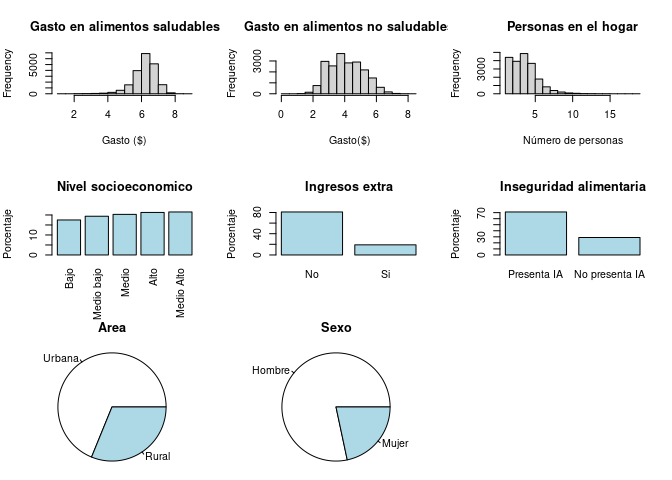
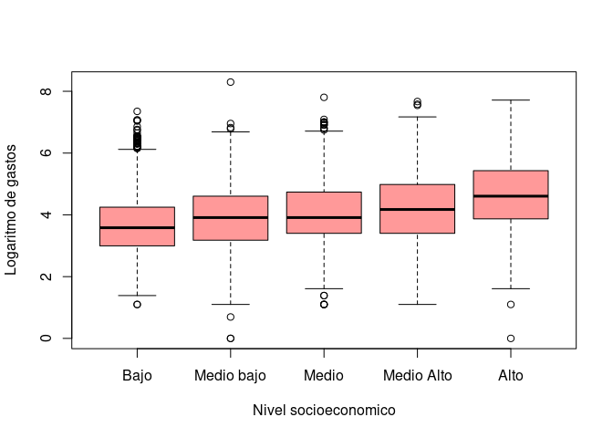
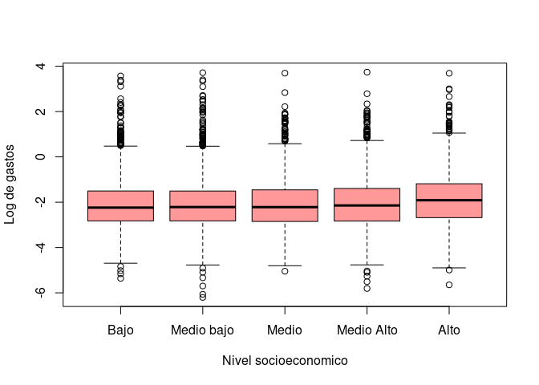
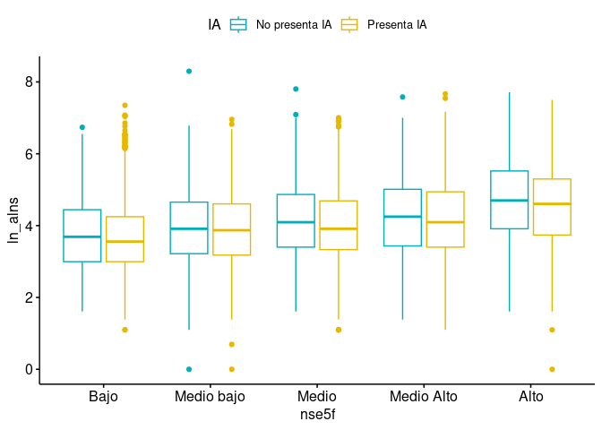
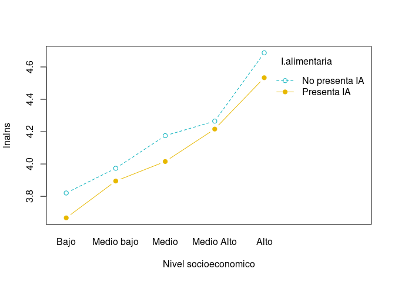

Postwork_8
================
2022-12-10

## Planteamiento del problema

Un centro de salud nutricional está interesado en analizar
estadísticamente y probabilísticamente los patrones de gasto en
alimentos saludables y no saludables en los hogares mexicanos con base
en su nivel socioeconómico, en si el hogar tiene recursos financieros
extra al ingreso y en si presenta o no inseguridad alimentaria. Además,
está interesado en un modelo que le permita identificar los
determinantes socioeconómicos de la inseguridad alimentaria.

##### Cargamos librerias

``` r
library(tidyverse)
```

    ## ── Attaching packages ─────────────────────────────────────── tidyverse 1.3.2 ──
    ## ✔ ggplot2 3.4.0      ✔ purrr   0.3.5 
    ## ✔ tibble  3.1.8      ✔ dplyr   1.0.10
    ## ✔ tidyr   1.2.1      ✔ stringr 1.5.0 
    ## ✔ readr   2.1.3      ✔ forcats 0.5.2 
    ## ── Conflicts ────────────────────────────────────────── tidyverse_conflicts() ──
    ## ✖ dplyr::filter() masks stats::filter()
    ## ✖ dplyr::lag()    masks stats::lag()

``` r
library(moments)
```

##### Lemos el data frame

``` r
df <- read.csv("https://raw.githubusercontent.com/beduExpert/Programacion-R-Santander-2022/main/Sesion-08/Postwork/inseguridad_alimentaria_bedu.csv")
```

##### Observamos cual es su estructura, cuantas columnas, que tipo de datos

- nse5f (Nivel socieconómico del hogar): 1 “Bajo”, 2 “Medio bajo”, 3
  “Medio”, 4 “Medio alto”, 5 “Alto”

- area (Zona geográfica): 0 “Zona urbana”, 1 “Zona rural”

- numpeho (Número de persona en el hogar)

- refin (Recursos financieros distintos al ingreso laboral): 0 “no”, 1
  “sí”

- edadjef (Edad del jefe/a de familia)

- sexoje (Sexo del jefe/a de familia): 0 “Hombre”, 1 “Mujer”

- añosedu (Años de educación del jefe de familia)

- ln_als (Logarítmo natural del gasto en alimentos saludables)

- ln_alns (Logarítmo natural del gasto en alimentos no saludables)

- IA (Inseguridad alimentaria en el hogar): 0 “No presenta IA”, 1
  “Presenta IA”

``` r
str(df)
```

    ## 'data.frame':    40809 obs. of  10 variables:
    ##  $ nse5f  : int  5 5 5 5 5 5 5 5 5 5 ...
    ##  $ area   : int  0 0 0 1 0 0 0 1 0 0 ...
    ##  $ numpeho: int  4 5 4 1 2 5 9 4 4 5 ...
    ##  $ refin  : int  0 1 0 0 1 1 0 0 0 0 ...
    ##  $ edadjef: int  43 NA 46 54 39 NA NA 48 54 41 ...
    ##  $ sexojef: int  0 NA 0 0 0 NA NA 0 0 0 ...
    ##  $ añosedu: int  24 24 24 24 24 24 24 24 24 24 ...
    ##  $ IA     : int  0 0 0 0 0 0 1 0 0 0 ...
    ##  $ ln_als : num  5.39 7.02 6.77 3.4 6.12 ...
    ##  $ ln_alns: num  NA NA 4.61 4.09 5.48 ...

##### Resumimos el data frame para ver si tiene el formato correcto

``` r
summary(df)
```

    ##      nse5f            area           numpeho           refin       
    ##  Min.   :1.000   Min.   :0.0000   Min.   : 1.000   Min.   :0.0000  
    ##  1st Qu.:2.000   1st Qu.:0.0000   1st Qu.: 3.000   1st Qu.:0.0000  
    ##  Median :3.000   Median :0.0000   Median : 4.000   Median :0.0000  
    ##  Mean   :2.901   Mean   :0.3484   Mean   : 3.941   Mean   :0.1902  
    ##  3rd Qu.:4.000   3rd Qu.:1.0000   3rd Qu.: 5.000   3rd Qu.:0.0000  
    ##  Max.   :5.000   Max.   :1.0000   Max.   :19.000   Max.   :1.0000  
    ##                                                                    
    ##     edadjef        sexojef         añosedu            IA        
    ##  Min.   : 18    Min.   :0.000   Min.   : 0.00   Min.   :0.0000  
    ##  1st Qu.: 37    1st Qu.:0.000   1st Qu.: 9.00   1st Qu.:0.0000  
    ##  Median : 47    Median :0.000   Median : 9.00   Median :1.0000  
    ##  Mean   : 49    Mean   :0.247   Mean   :10.36   Mean   :0.7358  
    ##  3rd Qu.: 60    3rd Qu.:0.000   3rd Qu.:12.00   3rd Qu.:1.0000  
    ##  Max.   :111    Max.   :1.000   Max.   :24.00   Max.   :1.0000  
    ##  NA's   :5017   NA's   :4991                                    
    ##      ln_als          ln_alns     
    ##  Min.   :0.6931   Min.   :0.000  
    ##  1st Qu.:5.7038   1st Qu.:3.401  
    ##  Median :6.1633   Median :4.025  
    ##  Mean   :6.0665   Mean   :4.125  
    ##  3rd Qu.:6.5511   3rd Qu.:4.868  
    ##  Max.   :8.9699   Max.   :8.403  
    ##  NA's   :787      NA's   :17504

Del resumen podemos observar que en las columnas
`edadjef, sexojef, ln_als, ln_alns` hay celdas con valores NA,vamos a
eliminarlos haciendo uso de la siguiente función

``` r
sum(complete.cases(df))
```

    ## [1] 20280

``` r
dfclean <- df[complete.cases(df),]
```

##### Vamos a dar formato a las variables por que tal como estan no nos proporcionan información de utilidad

``` r
dfclean$nse5f <- factor(dfclean$nse5f, labels  = c("Bajo", "Medio bajo" ,"Medio" , "Medio Alto" , "Alto"), ordered = TRUE)
dfclean$area <- factor(dfclean$area, labels = c("Zona urbana", "Zona rural"), ordered = TRUE)
dfclean$refin <- factor(dfclean$refin, labels = c("No", "Si"),ordered = TRUE)
dfclean$sexojef <- factor(dfclean$sexojef, labels = c("Hombre", "Mujer"), ordered = TRUE)
dfclean$IA <- factor(dfclean$IA, labels = c("No presenta IA", "Presenta IA"), ordered = TRUE)
```

##### Vamos a transformar el gasto en alimentos tanto saludables como no saludables en un número que nos de mas información que el logaritmo natural

``` r
dfclean$ln_als <- dfclean$ln_als
dfclean$ln_alns <- dfclean$ln_alns
df2 <- rename(dfclean,"als" = "ln_als", "alns"="ln_alns")
```

##### Resumimos los datos

``` r
summary(df2)
```

    ##         nse5f               area          numpeho       refin     
    ##  Bajo      :3553   Zona urbana:13959   Min.   : 1.000   No:16421  
    ##  Medio bajo:3927   Zona rural : 6321   1st Qu.: 3.000   Si: 3859  
    ##  Medio     :4119                       Median : 4.000             
    ##  Medio Alto:4364                       Mean   : 3.991             
    ##  Alto      :4317                       3rd Qu.: 5.000             
    ##                                        Max.   :19.000             
    ##     edadjef         sexojef         añosedu                  IA       
    ##  Min.   : 18.00   Hombre:15887   Min.   : 0.0   No presenta IA: 5853  
    ##  1st Qu.: 36.00   Mujer : 4393   1st Qu.: 9.0   Presenta IA   :14427  
    ##  Median : 46.00                  Median :12.0                         
    ##  Mean   : 47.32                  Mean   :10.9                         
    ##  3rd Qu.: 57.00                  3rd Qu.:12.0                         
    ##  Max.   :101.00                  Max.   :24.0                         
    ##       als             alns      
    ##  Min.   :1.099   Min.   :0.000  
    ##  1st Qu.:5.844   1st Qu.:3.401  
    ##  Median :6.274   Median :4.007  
    ##  Mean   :6.192   Mean   :4.119  
    ##  3rd Qu.:6.633   3rd Qu.:4.868  
    ##  Max.   :8.605   Max.   :8.298

##### Obtenemos tablas de frecuencia y frecuencia relativa para las variables: nivel socioeconomico, Ingreso extra, inseguridad alimentaria, area, sexo para complementar los datos obtenidos del resumen.

``` r
freq.nse <- table(df2$nse5f)
transform(freq.nse, 
          rel.freq=prop.table(freq.nse))
```

    ##         Var1 Freq rel.freq.Var1 rel.freq.Freq
    ## 1       Bajo 3553          Bajo     0.1751972
    ## 2 Medio bajo 3927    Medio bajo     0.1936391
    ## 3      Medio 4119         Medio     0.2031065
    ## 4 Medio Alto 4364    Medio Alto     0.2151874
    ## 5       Alto 4317          Alto     0.2128698

``` r
freq.refin <- table(df2$refin)
 transform(freq.refin, 
          rel.freq2=prop.table(freq.refin))
```

    ##   Var1  Freq rel.freq2.Var1 rel.freq2.Freq
    ## 1   No 16421             No       0.809714
    ## 2   Si  3859             Si       0.190286

``` r
freqIA <- table(df2$IA)
transform(freqIA, 
          rel.freq3=prop.table(freqIA))
```

    ##             Var1  Freq rel.freq3.Var1 rel.freq3.Freq
    ## 1 No presenta IA  5853 No presenta IA      0.2886095
    ## 2    Presenta IA 14427    Presenta IA      0.7113905

``` r
freq.area <- table(df2$area)
transform(freq.area, 
          rel.freq4=prop.table(freq.area))
```

    ##          Var1  Freq rel.freq4.Var1 rel.freq4.Freq
    ## 1 Zona urbana 13959    Zona urbana      0.6883136
    ## 2  Zona rural  6321     Zona rural      0.3116864

``` r
par(mfrow=c(3,3))

{ hist(df2$als, main = "Gasto en alimentos saludables", xlab = "Gasto ($)")
  
  hist(df2$alns, main = "Gasto en alimentos no saludables", xlab = " Gasto($)")
  
  hist(df2$numpeho, main = "Personas en el hogar", xlab = "Número de personas")
  
  barplot(100* sort(table(df2$nse5f)) / length(df2$nse5f), main = "Nivel socioeconomico", las = 3, ylab = "Porcentaje", col = "lightblue")
  
  barplot(100* sort(table(df2$refin), decreasing=T) / length(df2$refin), main = "Ingresos extra", ylab = "Porcentaje", col = "lightblue")
  
  barplot(100* sort(table(df2$IA), decreasing=T) / length(df2$IA), main = "Inseguridad alimentaria", ylab = "Porcentaje", col = "lightblue")
 
  par(mar=c(0, 0, 1.1, 0))
 # pie(table(df2$IA),labels <- round((100* sort(table(df2$IA)) / length(df2$IA)),1), main = "Inseguridad alimentaria")
  
  pie(table(df2$area),labels <- c("Urbana", "Rural"), main = "Area")
  
  pie(table(df2$sexoje), labels <- c("Hombre", "Mujer"), main = "Sexo")}
```

<!-- -->

- Quitando los casos NA podemos observar que el número de personas
  entrevistadas es muy parecido, representando la mayor cantidad el
  nivel medio alto con un porcentaje de 21.5 %, seguido de un 21.2 % del
  nivel alto y así en orden decreciente como se muestra en la grafica
  ‘Nivel socioeconomico’.”

- Podemos observar que el 80.9 % de las personas entrevistadas no
  cuentan con ingreso extra

- Se puede apreciar tambien en la grafica ‘Inseguridad alimentaria’ que
  el 71.1% de las personas presenta inseguridad alimentaria

- La Mayoria de los entrevistados reside en zonas urbanas (grafica
  área), y quien sustenta el hogar son en la mayoria hombres (Grafica
  Sexo)

- Del resumen podemos apreciar que la edad promedio del jefe de familia
  es de 47.32 años, con una educacion premedio de 10.9 años.

’’’ Del resumen anterior, tenemos que aproximadamente se entrevisto a la
misma cantidad de personas de diferentes clases, pero entre mas alta la
clase menor el numero de entrevistados. En cuanto al área predomina la
zona urbana con 65%. La edad del jefe de familia en promedio es de 49
años, la mayoria son hombres, con un promedio de educacion de 10.36
años. La mayoria de la poblacion presenta inseguridad alimentaria en el
hogar. El gasto promedio en alimentos saludables es de 540.3 pesos,
mientras que el gasto promedio en alimentos no saludables es de 109.3
’’’

### La mayoría de las personas afirman que los hogares con menor nivel socioeconómico tienden a gastar más en productos no saludables que las personas con mayores niveles socioeconómicos y que esto, entre otros determinantes, lleva a que un hogar presente cierta inseguridad alimentaria.

## Hipótesis

### Se establece un nivel de confianza de 99% para un nivel de significancia de 0.01

- Ho: En promedio gastan lo mismo independiente del nivel
  socioeconómico.

- Ha: Al menos hay un nivel socioeconómico donde el gasto promedio es
  distinto a los demás.

- Visualmente los gastos en alimentos no saludables dependiendo del
  nivel socioeconómico se ven de la siguiente manera

``` r
boxplot(dfclean$ln_alns ~ dfclean$nse5f, 
        xlab = "Nivel socioeconomico", 
        ylab = "Logaritmo de gastos", 
        col = rgb(1, 0, 0, alpha = 0.4))
```

<!-- -->

- Realizamos estadística preliminar

``` r
group_by(dfclean, nse5f) %>%
  summarise(
    mean = mean(ln_alns),
    sd = sd(ln_alns)
  )
```

    ## # A tibble: 5 × 3
    ##   nse5f       mean    sd
    ##   <ord>      <dbl> <dbl>
    ## 1 Bajo        3.69 0.943
    ## 2 Medio bajo  3.91 0.948
    ## 3 Medio       4.05 0.982
    ## 4 Medio Alto  4.23 1.02 
    ## 5 Alto        4.61 1.06

R. De la gráfica anterior y la estadística descriptiva se puede observar
que en promedio no gastan mas en alimentos no saludables los grupos con
menor nivel socioeconómico, el gasto va aumentando conforme incrementa
el Nivel socioecónomico, aunque hay que tomar en cuenta que tambien la
dispersión de los datos incrementa.

Considerando:

- Una muestra aleatoria
- Independiente
- Se distribuye de manera normal 
- Homogeneidad en las varianzas

- Vamos a realizar la prueba anova para inferir sobre la población,
  primero hacemos la prueba de varianzas de los diferentes grupos para
  ver si son iguales

Establecemos las hipótesis

- Ho: las varianzas son iguales
- Ha: las varianzas no son iguales

Hacemos la prueva para aceptar o rechazar las hipótesis con ayuda de la
función `leveneTest`

``` r
library(car)
```

    ## Loading required package: carData

    ## 
    ## Attaching package: 'car'

    ## The following object is masked from 'package:dplyr':
    ## 
    ##     recode

    ## The following object is masked from 'package:purrr':
    ## 
    ##     some

``` r
leveneTest(dfclean$ln_alns ~ dfclean$nse5f)
```

    ## Levene's Test for Homogeneity of Variance (center = median)
    ##          Df F value    Pr(>F)    
    ## group     4  30.187 < 2.2e-16 ***
    ##       20275                      
    ## ---
    ## Signif. codes:  0 '***' 0.001 '**' 0.01 '*' 0.05 '.' 0.1 ' ' 1

El resultado nos arroja un Pr(\>F) (\<2e-16) lo cual indica que se
rechaza la hipótesis nula para un nivel de significancia de 0.01, esto
es, al menos una varianza es diferente. Puesto que las varianzas no son
iguales vamos a emplear otra versión del método ANOVA

``` r
oneway.test(dfclean$ln_alns ~ dfclean$nse5f, var.equal = FALSE) # considerando varianzas desiguales
```

    ## 
    ##  One-way analysis of means (not assuming equal variances)
    ## 
    ## data:  dfclean$ln_alns and dfclean$nse5f
    ## F = 480.4, num df = 4, denom df = 10080, p-value < 2.2e-16

El resultado arroja un Pr(\>F) (\<2.2e-16) por lo que se rechaza la
hipotesis nula a un nivel de significancia de 0.01, esto quiere decir
que en promedio al menos los gastos entre dos nivel socioeconomico son
distintos.

Una vez que tenemos la prueba anterior y como no nos da mucha
información sobre las diferencias entre niveles, vamos a hacer uso de la
función `pairewise.t.test()` que se puede emplear para hacer
comparaciones entre grupos.

``` r
pairwise.t.test(dfclean$ln_alns, dfclean$nse5f,
                p.adjust.method = "BH", pool.sd = FALSE)
```

    ## 
    ##  Pairwise comparisons using t tests with non-pooled SD 
    ## 
    ## data:  dfclean$ln_alns and dfclean$nse5f 
    ## 
    ##            Bajo    Medio bajo Medio   Medio Alto
    ## Medio bajo < 2e-16 -          -       -         
    ## Medio      < 2e-16 2.4e-11    -       -         
    ## Medio Alto < 2e-16 < 2e-16    3.0e-16 -         
    ## Alto       < 2e-16 < 2e-16    < 2e-16 < 2e-16   
    ## 
    ## P value adjustment method: BH

Dado que todos los valores son cercanos a cero podemos considerar que
todas las diferencias entre niveles son significativas en los gastos en
alimentos no saludables. Con ayuda del boxplot y con esta prueba podemos
concluir que los gastos entre niveles en alimentos no saludables es
diferente, entre más alto el nivel mayor el gasto y por lo tanto la
afirmación que se hace en el planteamiento del problema se rechaza.
Posteriormente con el modelo podremos decidir que tanto influyen estas
variables en la inseguridad alimentaria.

##### En este punto cabe resltar que quiza la comparación no es equitativa por que el gasto depende de varios factores, por ejemplo: el ingreso, entre mas alto el nivel mayor ingreso y por lo tanto podria ser un factor que influya en el gasto en alimentos no saludables.

Una forma de tratar de hacerlo mas equitativo es considerando el gasto
total entre alimentos no saludables y saludables

Agregamos una columna a nuestro data frame dfclean con el nombre
`ratio2.alns.total` y lo asignamosa un objeto de nombre c2,
posteriormente seguimos los pasos que ya vimos anteriormente para ver si
hay alguna diferencia

``` r
c2<- dfclean %>% 
   mutate(ratio2.alns.total = log(exp(ln_alns)/exp(ln_als))) 
```

- Visualizamos

``` r
boxplot(c2$ratio2.alns.total ~ c2$nse5f, 
         xlab = "Nivel socioeconomico", 
         ylab = "Log de gastos", 
         col = rgb(1, 0, 0, alpha = 0.4))
```

<!-- -->

Considerando:

- Una muestra aleatoria
- Independiente
- Se distribuye de manera normal 
- Homogeneidad en las varianzas


Establecemos las hipótesis

- Ho: las varianzas de la razon entre gastos saludables y no sludables
  son iguales
- Ha: las varianzas no son iguales

Hacemos la prueba para mostrar si las varianzas son iguales

``` r
 leveneTest(c2$ratio2.alns.total ~ c2$nse5f)
```

    ## Levene's Test for Homogeneity of Variance (center = median)
    ##          Df F value    Pr(>F)    
    ## group     4  7.7317 3.201e-06 ***
    ##       20275                      
    ## ---
    ## Signif. codes:  0 '***' 0.001 '**' 0.01 '*' 0.05 '.' 0.1 ' ' 1

R.- Para el nivel de significacia de 0.01 con un p-value de 3.201e-06 se
rechaza la hipótesis nula, esto es, al menos una varianza en la razon es
distinta por grupo.

- Como las varianzas no son iguales aplicamos la prueba anova en la
  forma para varianzas desiguales

``` r
 oneway.test(c2$ratio2.alns.total ~ c2$nse5f, var.equal = FALSE)
```

    ## 
    ##  One-way analysis of means (not assuming equal variances)
    ## 
    ## data:  c2$ratio2.alns.total and c2$nse5f
    ## F = 27.319, num df = 4, denom df = 10053, p-value < 2.2e-16

De aquí podemos observar que se rechaza la hipótesis nula, esto es, la
razon de gastos en promedio de un nivel socioeconomico en alimentos no
saludables es distinto a los otros.

Aplicamos la prueba para determinar cuales diferencias entre niveles son
relevantes

``` r
pairwise.t.test(c2$ratio2.alns.total, c2$nse5f, 
                 p.adjust.method = "BH", pool.sd = FALSE)
```

    ## 
    ##  Pairwise comparisons using t tests with non-pooled SD 
    ## 
    ## data:  c2$ratio2.alns.total and c2$nse5f 
    ## 
    ##            Bajo    Medio bajo Medio   Medio Alto
    ## Medio bajo 0.77    -          -       -         
    ## Medio      0.77    0.94       -       -         
    ## Medio Alto 0.62    0.36       0.36    -         
    ## Alto       1.3e-14 < 2e-16    < 2e-16 1.6e-13   
    ## 
    ## P value adjustment method: BH

De esta prueba las diferencias entre bajo-medio bajo, bajo-medio,
bajo-medio alto, medio bajo-medio no son relevantes la razon entre
gastos en alimentos no saludables se puede considerar igual, mientras
que entre los otros niveles las diferencias son significativas.

#### Vamos a realizar una prueba anova de dos lados (two sided) para ver si los gastos en alimentos no saludables dependiendo del nivel socioeconomico influyen en la inseguridad alimentaria

- Hopotesis Ho:

1)  No hay diferencia en el gasto promedio en alns dependiendo del nivel
    socioeconomico.

2)  No hay diferencia en los gastos promedios en alns que impliquen
    inseguridad alimentaria

3)  No hay relación entre el nivel socioeconomico y la inseguridad
    alimentaria

- Ha: para a y b: los gastos promedios no son todos iguales.

- Ha: para c: hay relacion entre el nivel socioeconomico y la
  inseguridad alimentaria.

``` r
frec.t <- table(dfclean$nse5f,dfclean$IA)
frec.t
```

    ##             
    ##              No presenta IA Presenta IA
    ##   Bajo                  499        3054
    ##   Medio bajo            761        3166
    ##   Medio                 989        3130
    ##   Medio Alto           1431        2933
    ##   Alto                 2173        2144

- Visualizamos los datos separados por nivel socioeconomico y si
  presentan o no inseguridad alimentaria

``` r
install.packages("ggpubr")
```

    ## Installing package into '/cloud/lib/x86_64-pc-linux-gnu-library/4.2'
    ## (as 'lib' is unspecified)

``` r
library(ggpubr)
```

``` r
ggboxplot(dfclean, x = "nse5f", y = "ln_alns", color = "IA",
          palette = c("#00AFBB", "#E7B800"))
```

<!-- -->

- La siguiente grafica muestra si existe interacción entre grupos
  dependiendo del nivel socioeconomico

``` r
I.alimentaria <- dfclean$IA
interaction.plot(x.factor = dfclean$nse5f, trace.factor = I.alimentaria, 
                 response = dfclean$ln_alns, fun = mean, 
                 type = "b", legend = TRUE, 
                 xlab = "Nivel socioeconomico", ylab="lnalns",
                 pch=c(1,19), col = c("#00AFBB", "#E7B800"))
```

<!-- -->

- Realizamos estadistica preeliminar

``` r
group_by(dfclean, nse5f, IA) %>%
  summarise(
    mean = mean(ln_alns),
    sd = sd(ln_alns)
  )
```

    ## `summarise()` has grouped output by 'nse5f'. You can override using the
    ## `.groups` argument.

    ## # A tibble: 10 × 4
    ## # Groups:   nse5f [5]
    ##    nse5f      IA              mean    sd
    ##    <ord>      <ord>          <dbl> <dbl>
    ##  1 Bajo       No presenta IA  3.82 0.924
    ##  2 Bajo       Presenta IA     3.67 0.944
    ##  3 Medio bajo No presenta IA  3.97 1.02 
    ##  4 Medio bajo Presenta IA     3.89 0.929
    ##  5 Medio      No presenta IA  4.18 0.996
    ##  6 Medio      Presenta IA     4.02 0.974
    ##  7 Medio Alto No presenta IA  4.27 1.04 
    ##  8 Medio Alto Presenta IA     4.22 1.01 
    ##  9 Alto       No presenta IA  4.69 1.07 
    ## 10 Alto       Presenta IA     4.53 1.05

#### Considerando que la inseguridad alimetaria es independiente del nivel socioeconomico

``` r
anova_test <- aov(dfclean$ln_alns ~ dfclean$nse5f+dfclean$IA)
summary(anova_test)
```

    ##                  Df Sum Sq Mean Sq F value   Pr(>F)    
    ## dfclean$nse5f     4   1949   487.2  493.97  < 2e-16 ***
    ## dfclean$IA        1     52    52.3   52.98 3.48e-13 ***
    ## Residuals     20274  19995     1.0                     
    ## ---
    ## Signif. codes:  0 '***' 0.001 '**' 0.01 '*' 0.05 '.' 0.1 ' ' 1

R. de acuerdo a los resultados tanto el nivel socioeconomico como la
inseguridad alimentaria tienen significancia, lo que podria indicar que
los gastos en alimentos no saludables dependen tanto del nivel
socioeconomico como de si hay o no inseguridad alimentaria.

#### Two-way ANOVA con efectos de interacción

``` r
res.aov <- aov(dfclean$ln_alns ~ dfclean$nse5f*dfclean$IA)
summary(res.aov)
```

    ##                             Df Sum Sq Mean Sq F value   Pr(>F)    
    ## dfclean$nse5f                4   1949   487.2 494.085  < 2e-16 ***
    ## dfclean$IA                   1     52    52.3  52.997 3.46e-13 ***
    ## dfclean$nse5f:dfclean$IA     4      9     2.2   2.215   0.0647 .  
    ## Residuals                20270  19986     1.0                     
    ## ---
    ## Signif. codes:  0 '***' 0.001 '**' 0.01 '*' 0.05 '.' 0.1 ' ' 1

R. De esta prueba podemos concluir que tanto el nivel socioeconomico
como la inseguridad alimentaria son significantes, al igual que su
interacción. Si consideramos independencia entre los gastos y el nivel
socioeconomico

##### MODELO PROBABILISTICO
